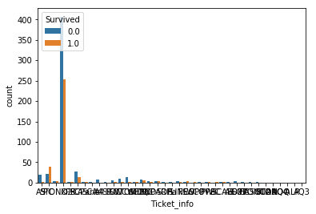
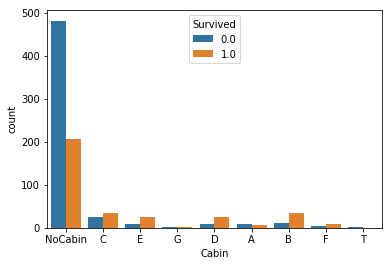

# Kaggle-鐵達尼生存預測分析

### 此專案的分析目標主要是藉由搭乘鐵達尼的乘客所擁有的屬性去預測這名乘客最後是否存活，1代表存活(survived)，0代表死亡(did not survived)。以下說明資料處理流程及預測結果。

## 1. 匯入需要的套件及資料集


```python
#匯入需要的套件
from sklearn import preprocessing 
from sklearn.model_selection import GridSearchCV 
from sklearn.ensemble import RandomForestClassifier 
from sklearn.ensemble import RandomForestRegressor

import warnings
import pandas as pd
import numpy as np
import matplotlib.pyplot as plt
import seaborn as sns

%matplotlib inline
pd.options.mode.chained_assignment = None
```


```python
#匯入資料集
train = pd.read_csv("Titanic/train.csv")
test = pd.read_csv("Titanic/test.csv")
submit = pd.read_csv('Titanic/gender_submission.csv')
```

## 2. 觀察資料的型態

### 2.1此數據訓練集共有891位乘客，資料內容包含:

* 乘客編號　PassengerId: int
* 存活與否　Survived: int
* 艙等　　　Pclass: int
* 姓名　　　Name: string
* 性別　　　Sex: string
* 年齡　　　Age: float
* 親戚人數　SibSp: int
* 父母子女人數　Parch: int
* 船票編號　Ticket: string
* 船票費用　Fare: float
* 船艙座位　Cabin: string
* 搭乘港口　Embarked: string


```python
train.head(5)
```


<div>
<style>
    .dataframe thead tr:only-child th {
        text-align: right;
    }

    .dataframe thead th {
        text-align: left;
    }

    .dataframe tbody tr th {
        vertical-align: top;
    }
</style>
<table border="1" class="dataframe">
  <thead>
    <tr style="text-align: right;">
      <th></th>
      <th>PassengerId</th>
      <th>Survived</th>
      <th>Pclass</th>
      <th>Name</th>
      <th>Sex</th>
      <th>Age</th>
      <th>SibSp</th>
      <th>Parch</th>
      <th>Ticket</th>
      <th>Fare</th>
      <th>Cabin</th>
      <th>Embarked</th>
    </tr>
  </thead>
  <tbody>
    <tr>
      <th>0</th>
      <td>1</td>
      <td>0</td>
      <td>3</td>
      <td>Braund, Mr. Owen Harris</td>
      <td>male</td>
      <td>22.0</td>
      <td>1</td>
      <td>0</td>
      <td>A/5 21171</td>
      <td>7.2500</td>
      <td>NaN</td>
      <td>S</td>
    </tr>
    <tr>
      <th>1</th>
      <td>2</td>
      <td>1</td>
      <td>1</td>
      <td>Cumings, Mrs. John Bradley (Florence Briggs Th...</td>
      <td>female</td>
      <td>38.0</td>
      <td>1</td>
      <td>0</td>
      <td>PC 17599</td>
      <td>71.2833</td>
      <td>C85</td>
      <td>C</td>
    </tr>
    <tr>
      <th>2</th>
      <td>3</td>
      <td>1</td>
      <td>3</td>
      <td>Heikkinen, Miss. Laina</td>
      <td>female</td>
      <td>26.0</td>
      <td>0</td>
      <td>0</td>
      <td>STON/O2. 3101282</td>
      <td>7.9250</td>
      <td>NaN</td>
      <td>S</td>
    </tr>
    <tr>
      <th>3</th>
      <td>4</td>
      <td>1</td>
      <td>1</td>
      <td>Futrelle, Mrs. Jacques Heath (Lily May Peel)</td>
      <td>female</td>
      <td>35.0</td>
      <td>1</td>
      <td>0</td>
      <td>113803</td>
      <td>53.1000</td>
      <td>C123</td>
      <td>S</td>
    </tr>
    <tr>
      <th>4</th>
      <td>5</td>
      <td>0</td>
      <td>3</td>
      <td>Allen, Mr. William Henry</td>
      <td>male</td>
      <td>35.0</td>
      <td>0</td>
      <td>0</td>
      <td>373450</td>
      <td>8.0500</td>
      <td>NaN</td>
      <td>S</td>
    </tr>
  </tbody>
</table>
</div>


### 2.2從以下測試集的資料可觀察到Age, Cabin, Fare等變數存在缺漏值的問題


```python
test.info()
```

    <class 'pandas.core.frame.DataFrame'>
    RangeIndex: 418 entries, 0 to 417
    Data columns (total 11 columns):
    PassengerId    418 non-null int64
    Pclass         418 non-null int64
    Name           418 non-null object
    Sex            418 non-null object
    Age            332 non-null float64
    SibSp          418 non-null int64
    Parch          418 non-null int64
    Ticket         418 non-null object
    Fare           417 non-null float64
    Cabin          91 non-null object
    Embarked       418 non-null object
    dtypes: float64(2), int64(4), object(5)
    memory usage: 36.0+ KB
    


```python
train.describe()
```


<div>
<style>
    .dataframe thead tr:only-child th {
        text-align: right;
    }

    .dataframe thead th {
        text-align: left;
    }

    .dataframe tbody tr th {
        vertical-align: top;
    }
</style>
<table border="1" class="dataframe">
  <thead>
    <tr style="text-align: right;">
      <th></th>
      <th>PassengerId</th>
      <th>Survived</th>
      <th>Pclass</th>
      <th>Age</th>
      <th>SibSp</th>
      <th>Parch</th>
      <th>Fare</th>
    </tr>
  </thead>
  <tbody>
    <tr>
      <th>count</th>
      <td>891.000000</td>
      <td>891.000000</td>
      <td>891.000000</td>
      <td>714.000000</td>
      <td>891.000000</td>
      <td>891.000000</td>
      <td>891.000000</td>
    </tr>
    <tr>
      <th>mean</th>
      <td>446.000000</td>
      <td>0.383838</td>
      <td>2.308642</td>
      <td>29.699118</td>
      <td>0.523008</td>
      <td>0.381594</td>
      <td>32.204208</td>
    </tr>
    <tr>
      <th>std</th>
      <td>257.353842</td>
      <td>0.486592</td>
      <td>0.836071</td>
      <td>14.526497</td>
      <td>1.102743</td>
      <td>0.806057</td>
      <td>49.693429</td>
    </tr>
    <tr>
      <th>min</th>
      <td>1.000000</td>
      <td>0.000000</td>
      <td>1.000000</td>
      <td>0.420000</td>
      <td>0.000000</td>
      <td>0.000000</td>
      <td>0.000000</td>
    </tr>
    <tr>
      <th>25%</th>
      <td>223.500000</td>
      <td>0.000000</td>
      <td>2.000000</td>
      <td>20.125000</td>
      <td>0.000000</td>
      <td>0.000000</td>
      <td>7.910400</td>
    </tr>
    <tr>
      <th>50%</th>
      <td>446.000000</td>
      <td>0.000000</td>
      <td>3.000000</td>
      <td>28.000000</td>
      <td>0.000000</td>
      <td>0.000000</td>
      <td>14.454200</td>
    </tr>
    <tr>
      <th>75%</th>
      <td>668.500000</td>
      <td>1.000000</td>
      <td>3.000000</td>
      <td>38.000000</td>
      <td>1.000000</td>
      <td>0.000000</td>
      <td>31.000000</td>
    </tr>
    <tr>
      <th>max</th>
      <td>891.000000</td>
      <td>1.000000</td>
      <td>3.000000</td>
      <td>80.000000</td>
      <td>8.000000</td>
      <td>6.000000</td>
      <td>512.329200</td>
    </tr>
  </tbody>
</table>
</div>


```python
test.describe()
```


<div>
<style>
    .dataframe thead tr:only-child th {
        text-align: right;
    }

    .dataframe thead th {
        text-align: left;
    }

    .dataframe tbody tr th {
        vertical-align: top;
    }
</style>
<table border="1" class="dataframe">
  <thead>
    <tr style="text-align: right;">
      <th></th>
      <th>PassengerId</th>
      <th>Pclass</th>
      <th>Age</th>
      <th>SibSp</th>
      <th>Parch</th>
      <th>Fare</th>
    </tr>
  </thead>
  <tbody>
    <tr>
      <th>count</th>
      <td>418.000000</td>
      <td>418.000000</td>
      <td>332.000000</td>
      <td>418.000000</td>
      <td>418.000000</td>
      <td>417.000000</td>
    </tr>
    <tr>
      <th>mean</th>
      <td>1100.500000</td>
      <td>2.265550</td>
      <td>30.272590</td>
      <td>0.447368</td>
      <td>0.392344</td>
      <td>35.627188</td>
    </tr>
    <tr>
      <th>std</th>
      <td>120.810458</td>
      <td>0.841838</td>
      <td>14.181209</td>
      <td>0.896760</td>
      <td>0.981429</td>
      <td>55.907576</td>
    </tr>
    <tr>
      <th>min</th>
      <td>892.000000</td>
      <td>1.000000</td>
      <td>0.170000</td>
      <td>0.000000</td>
      <td>0.000000</td>
      <td>0.000000</td>
    </tr>
    <tr>
      <th>25%</th>
      <td>996.250000</td>
      <td>1.000000</td>
      <td>21.000000</td>
      <td>0.000000</td>
      <td>0.000000</td>
      <td>7.895800</td>
    </tr>
    <tr>
      <th>50%</th>
      <td>1100.500000</td>
      <td>3.000000</td>
      <td>27.000000</td>
      <td>0.000000</td>
      <td>0.000000</td>
      <td>14.454200</td>
    </tr>
    <tr>
      <th>75%</th>
      <td>1204.750000</td>
      <td>3.000000</td>
      <td>39.000000</td>
      <td>1.000000</td>
      <td>0.000000</td>
      <td>31.500000</td>
    </tr>
    <tr>
      <th>max</th>
      <td>1309.000000</td>
      <td>3.000000</td>
      <td>76.000000</td>
      <td>8.000000</td>
      <td>9.000000</td>
      <td>512.329200</td>
    </tr>
  </tbody>
</table>
</div>


### 2.3將訓練資料及測試資料合併起來，利用敘述統計觀察變數間的關係


```python
data = train.append(test)
data
```


<div>
<style>
    .dataframe thead tr:only-child th {
        text-align: right;
    }

    .dataframe thead th {
        text-align: left;
    }

    .dataframe tbody tr th {
        vertical-align: top;
    }
</style>
<table border="1" class="dataframe">
  <thead>
    <tr style="text-align: right;">
      <th></th>
      <th>Age</th>
      <th>Cabin</th>
      <th>Embarked</th>
      <th>Fare</th>
      <th>Name</th>
      <th>Parch</th>
      <th>PassengerId</th>
      <th>Pclass</th>
      <th>Sex</th>
      <th>SibSp</th>
      <th>Survived</th>
      <th>Ticket</th>
    </tr>
  </thead>
  <tbody>
    <tr>
      <th>0</th>
      <td>22.0</td>
      <td>NaN</td>
      <td>S</td>
      <td>7.2500</td>
      <td>Braund, Mr. Owen Harris</td>
      <td>0</td>
      <td>1</td>
      <td>3</td>
      <td>male</td>
      <td>1</td>
      <td>0.0</td>
      <td>A/5 21171</td>
    </tr>
    <tr>
      <th>1</th>
      <td>38.0</td>
      <td>C85</td>
      <td>C</td>
      <td>71.2833</td>
      <td>Cumings, Mrs. John Bradley (Florence Briggs Th...</td>
      <td>0</td>
      <td>2</td>
      <td>1</td>
      <td>female</td>
      <td>1</td>
      <td>1.0</td>
      <td>PC 17599</td>
    </tr>
    <tr>
      <th>2</th>
      <td>26.0</td>
      <td>NaN</td>
      <td>S</td>
      <td>7.9250</td>
      <td>Heikkinen, Miss. Laina</td>
      <td>0</td>
      <td>3</td>
      <td>3</td>
      <td>female</td>
      <td>0</td>
      <td>1.0</td>
      <td>STON/O2. 3101282</td>
    </tr>
    <tr>
      <th>3</th>
      <td>35.0</td>
      <td>C123</td>
      <td>S</td>
      <td>53.1000</td>
      <td>Futrelle, Mrs. Jacques Heath (Lily May Peel)</td>
      <td>0</td>
      <td>4</td>
      <td>1</td>
      <td>female</td>
      <td>1</td>
      <td>1.0</td>
      <td>113803</td>
    </tr>
    <tr>
      <th>4</th>
      <td>35.0</td>
      <td>NaN</td>
      <td>S</td>
      <td>8.0500</td>
      <td>Allen, Mr. William Henry</td>
      <td>0</td>
      <td>5</td>
      <td>3</td>
      <td>male</td>
      <td>0</td>
      <td>0.0</td>
      <td>373450</td>
    </tr>
    <tr>
      <th>5</th>
      <td>NaN</td>
      <td>NaN</td>
      <td>Q</td>
      <td>8.4583</td>
      <td>Moran, Mr. James</td>
      <td>0</td>
      <td>6</td>
      <td>3</td>
      <td>male</td>
      <td>0</td>
      <td>0.0</td>
      <td>330877</td>
    </tr>
    <tr>
      <th>6</th>
      <td>54.0</td>
      <td>E46</td>
      <td>S</td>
      <td>51.8625</td>
      <td>McCarthy, Mr. Timothy J</td>
      <td>0</td>
      <td>7</td>
      <td>1</td>
      <td>male</td>
      <td>0</td>
      <td>0.0</td>
      <td>17463</td>
    </tr>
    <tr>
      <th>7</th>
      <td>2.0</td>
      <td>NaN</td>
      <td>S</td>
      <td>21.0750</td>
      <td>Palsson, Master. Gosta Leonard</td>
      <td>1</td>
      <td>8</td>
      <td>3</td>
      <td>male</td>
      <td>3</td>
      <td>0.0</td>
      <td>349909</td>
    </tr>
    <tr>
      <th>8</th>
      <td>27.0</td>
      <td>NaN</td>
      <td>S</td>
      <td>11.1333</td>
      <td>Johnson, Mrs. Oscar W (Elisabeth Vilhelmina Berg)</td>
      <td>2</td>
      <td>9</td>
      <td>3</td>
      <td>female</td>
      <td>0</td>
      <td>1.0</td>
      <td>347742</td>
    </tr>
    <tr>
      <th>9</th>
      <td>14.0</td>
      <td>NaN</td>
      <td>C</td>
      <td>30.0708</td>
      <td>Nasser, Mrs. Nicholas (Adele Achem)</td>
      <td>0</td>
      <td>10</td>
      <td>2</td>
      <td>female</td>
      <td>1</td>
      <td>1.0</td>
      <td>237736</td>
    </tr>
    <tr>
      <th>10</th>
      <td>4.0</td>
      <td>G6</td>
      <td>S</td>
      <td>16.7000</td>
      <td>Sandstrom, Miss. Marguerite Rut</td>
      <td>1</td>
      <td>11</td>
      <td>3</td>
      <td>female</td>
      <td>1</td>
      <td>1.0</td>
      <td>PP 9549</td>
    </tr>
    <tr>
      <th>11</th>
      <td>58.0</td>
      <td>C103</td>
      <td>S</td>
      <td>26.5500</td>
      <td>Bonnell, Miss. Elizabeth</td>
      <td>0</td>
      <td>12</td>
      <td>1</td>
      <td>female</td>
      <td>0</td>
      <td>1.0</td>
      <td>113783</td>
    </tr>
    <tr>
      <th>12</th>
      <td>20.0</td>
      <td>NaN</td>
      <td>S</td>
      <td>8.0500</td>
      <td>Saundercock, Mr. William Henry</td>
      <td>0</td>
      <td>13</td>
      <td>3</td>
      <td>male</td>
      <td>0</td>
      <td>0.0</td>
      <td>A/5. 2151</td>
    </tr>
    <tr>
      <th>13</th>
      <td>39.0</td>
      <td>NaN</td>
      <td>S</td>
      <td>31.2750</td>
      <td>Andersson, Mr. Anders Johan</td>
      <td>5</td>
      <td>14</td>
      <td>3</td>
      <td>male</td>
      <td>1</td>
      <td>0.0</td>
      <td>347082</td>
    </tr>
    <tr>
      <th>14</th>
      <td>14.0</td>
      <td>NaN</td>
      <td>S</td>
      <td>7.8542</td>
      <td>Vestrom, Miss. Hulda Amanda Adolfina</td>
      <td>0</td>
      <td>15</td>
      <td>3</td>
      <td>female</td>
      <td>0</td>
      <td>0.0</td>
      <td>350406</td>
    </tr>
    <tr>
      <th>15</th>
      <td>55.0</td>
      <td>NaN</td>
      <td>S</td>
      <td>16.0000</td>
      <td>Hewlett, Mrs. (Mary D Kingcome)</td>
      <td>0</td>
      <td>16</td>
      <td>2</td>
      <td>female</td>
      <td>0</td>
      <td>1.0</td>
      <td>248706</td>
    </tr>
    <tr>
      <th>16</th>
      <td>2.0</td>
      <td>NaN</td>
      <td>Q</td>
      <td>29.1250</td>
      <td>Rice, Master. Eugene</td>
      <td>1</td>
      <td>17</td>
      <td>3</td>
      <td>male</td>
      <td>4</td>
      <td>0.0</td>
      <td>382652</td>
    </tr>
    <tr>
      <th>17</th>
      <td>NaN</td>
      <td>NaN</td>
      <td>S</td>
      <td>13.0000</td>
      <td>Williams, Mr. Charles Eugene</td>
      <td>0</td>
      <td>18</td>
      <td>2</td>
      <td>male</td>
      <td>0</td>
      <td>1.0</td>
      <td>244373</td>
    </tr>
    <tr>
      <th>18</th>
      <td>31.0</td>
      <td>NaN</td>
      <td>S</td>
      <td>18.0000</td>
      <td>Vander Planke, Mrs. Julius (Emelia Maria Vande...</td>
      <td>0</td>
      <td>19</td>
      <td>3</td>
      <td>female</td>
      <td>1</td>
      <td>0.0</td>
      <td>345763</td>
    </tr>
    <tr>
      <th>19</th>
      <td>NaN</td>
      <td>NaN</td>
      <td>C</td>
      <td>7.2250</td>
      <td>Masselmani, Mrs. Fatima</td>
      <td>0</td>
      <td>20</td>
      <td>3</td>
      <td>female</td>
      <td>0</td>
      <td>1.0</td>
      <td>2649</td>
    </tr>
    <tr>
      <th>20</th>
      <td>35.0</td>
      <td>NaN</td>
      <td>S</td>
      <td>26.0000</td>
      <td>Fynney, Mr. Joseph J</td>
      <td>0</td>
      <td>21</td>
      <td>2</td>
      <td>male</td>
      <td>0</td>
      <td>0.0</td>
      <td>239865</td>
    </tr>
    <tr>
      <th>21</th>
      <td>34.0</td>
      <td>D56</td>
      <td>S</td>
      <td>13.0000</td>
      <td>Beesley, Mr. Lawrence</td>
      <td>0</td>
      <td>22</td>
      <td>2</td>
      <td>male</td>
      <td>0</td>
      <td>1.0</td>
      <td>248698</td>
    </tr>
    <tr>
      <th>22</th>
      <td>15.0</td>
      <td>NaN</td>
      <td>Q</td>
      <td>8.0292</td>
      <td>McGowan, Miss. Anna "Annie"</td>
      <td>0</td>
      <td>23</td>
      <td>3</td>
      <td>female</td>
      <td>0</td>
      <td>1.0</td>
      <td>330923</td>
    </tr>
    <tr>
      <th>23</th>
      <td>28.0</td>
      <td>A6</td>
      <td>S</td>
      <td>35.5000</td>
      <td>Sloper, Mr. William Thompson</td>
      <td>0</td>
      <td>24</td>
      <td>1</td>
      <td>male</td>
      <td>0</td>
      <td>1.0</td>
      <td>113788</td>
    </tr>
    <tr>
      <th>24</th>
      <td>8.0</td>
      <td>NaN</td>
      <td>S</td>
      <td>21.0750</td>
      <td>Palsson, Miss. Torborg Danira</td>
      <td>1</td>
      <td>25</td>
      <td>3</td>
      <td>female</td>
      <td>3</td>
      <td>0.0</td>
      <td>349909</td>
    </tr>
    <tr>
      <th>25</th>
      <td>38.0</td>
      <td>NaN</td>
      <td>S</td>
      <td>31.3875</td>
      <td>Asplund, Mrs. Carl Oscar (Selma Augusta Emilia...</td>
      <td>5</td>
      <td>26</td>
      <td>3</td>
      <td>female</td>
      <td>1</td>
      <td>1.0</td>
      <td>347077</td>
    </tr>
    <tr>
      <th>26</th>
      <td>NaN</td>
      <td>NaN</td>
      <td>C</td>
      <td>7.2250</td>
      <td>Emir, Mr. Farred Chehab</td>
      <td>0</td>
      <td>27</td>
      <td>3</td>
      <td>male</td>
      <td>0</td>
      <td>0.0</td>
      <td>2631</td>
    </tr>
    <tr>
      <th>27</th>
      <td>19.0</td>
      <td>C23 C25 C27</td>
      <td>S</td>
      <td>263.0000</td>
      <td>Fortune, Mr. Charles Alexander</td>
      <td>2</td>
      <td>28</td>
      <td>1</td>
      <td>male</td>
      <td>3</td>
      <td>0.0</td>
      <td>19950</td>
    </tr>
    <tr>
      <th>28</th>
      <td>NaN</td>
      <td>NaN</td>
      <td>Q</td>
      <td>7.8792</td>
      <td>O'Dwyer, Miss. Ellen "Nellie"</td>
      <td>0</td>
      <td>29</td>
      <td>3</td>
      <td>female</td>
      <td>0</td>
      <td>1.0</td>
      <td>330959</td>
    </tr>
    <tr>
      <th>29</th>
      <td>NaN</td>
      <td>NaN</td>
      <td>S</td>
      <td>7.8958</td>
      <td>Todoroff, Mr. Lalio</td>
      <td>0</td>
      <td>30</td>
      <td>3</td>
      <td>male</td>
      <td>0</td>
      <td>0.0</td>
      <td>349216</td>
    </tr>
    <tr>
      <th>...</th>
      <td>...</td>
      <td>...</td>
      <td>...</td>
      <td>...</td>
      <td>...</td>
      <td>...</td>
      <td>...</td>
      <td>...</td>
      <td>...</td>
      <td>...</td>
      <td>...</td>
      <td>...</td>
    </tr>
    <tr>
      <th>388</th>
      <td>21.0</td>
      <td>NaN</td>
      <td>Q</td>
      <td>7.7500</td>
      <td>Canavan, Mr. Patrick</td>
      <td>0</td>
      <td>1280</td>
      <td>3</td>
      <td>male</td>
      <td>0</td>
      <td>NaN</td>
      <td>364858</td>
    </tr>
    <tr>
      <th>389</th>
      <td>6.0</td>
      <td>NaN</td>
      <td>S</td>
      <td>21.0750</td>
      <td>Palsson, Master. Paul Folke</td>
      <td>1</td>
      <td>1281</td>
      <td>3</td>
      <td>male</td>
      <td>3</td>
      <td>NaN</td>
      <td>349909</td>
    </tr>
    <tr>
      <th>390</th>
      <td>23.0</td>
      <td>B24</td>
      <td>S</td>
      <td>93.5000</td>
      <td>Payne, Mr. Vivian Ponsonby</td>
      <td>0</td>
      <td>1282</td>
      <td>1</td>
      <td>male</td>
      <td>0</td>
      <td>NaN</td>
      <td>12749</td>
    </tr>
    <tr>
      <th>391</th>
      <td>51.0</td>
      <td>D28</td>
      <td>S</td>
      <td>39.4000</td>
      <td>Lines, Mrs. Ernest H (Elizabeth Lindsey James)</td>
      <td>1</td>
      <td>1283</td>
      <td>1</td>
      <td>female</td>
      <td>0</td>
      <td>NaN</td>
      <td>PC 17592</td>
    </tr>
    <tr>
      <th>392</th>
      <td>13.0</td>
      <td>NaN</td>
      <td>S</td>
      <td>20.2500</td>
      <td>Abbott, Master. Eugene Joseph</td>
      <td>2</td>
      <td>1284</td>
      <td>3</td>
      <td>male</td>
      <td>0</td>
      <td>NaN</td>
      <td>C.A. 2673</td>
    </tr>
    <tr>
      <th>393</th>
      <td>47.0</td>
      <td>NaN</td>
      <td>S</td>
      <td>10.5000</td>
      <td>Gilbert, Mr. William</td>
      <td>0</td>
      <td>1285</td>
      <td>2</td>
      <td>male</td>
      <td>0</td>
      <td>NaN</td>
      <td>C.A. 30769</td>
    </tr>
    <tr>
      <th>394</th>
      <td>29.0</td>
      <td>NaN</td>
      <td>S</td>
      <td>22.0250</td>
      <td>Kink-Heilmann, Mr. Anton</td>
      <td>1</td>
      <td>1286</td>
      <td>3</td>
      <td>male</td>
      <td>3</td>
      <td>NaN</td>
      <td>315153</td>
    </tr>
    <tr>
      <th>395</th>
      <td>18.0</td>
      <td>C31</td>
      <td>S</td>
      <td>60.0000</td>
      <td>Smith, Mrs. Lucien Philip (Mary Eloise Hughes)</td>
      <td>0</td>
      <td>1287</td>
      <td>1</td>
      <td>female</td>
      <td>1</td>
      <td>NaN</td>
      <td>13695</td>
    </tr>
    <tr>
      <th>396</th>
      <td>24.0</td>
      <td>NaN</td>
      <td>Q</td>
      <td>7.2500</td>
      <td>Colbert, Mr. Patrick</td>
      <td>0</td>
      <td>1288</td>
      <td>3</td>
      <td>male</td>
      <td>0</td>
      <td>NaN</td>
      <td>371109</td>
    </tr>
    <tr>
      <th>397</th>
      <td>48.0</td>
      <td>B41</td>
      <td>C</td>
      <td>79.2000</td>
      <td>Frolicher-Stehli, Mrs. Maxmillian (Margaretha ...</td>
      <td>1</td>
      <td>1289</td>
      <td>1</td>
      <td>female</td>
      <td>1</td>
      <td>NaN</td>
      <td>13567</td>
    </tr>
    <tr>
      <th>398</th>
      <td>22.0</td>
      <td>NaN</td>
      <td>S</td>
      <td>7.7750</td>
      <td>Larsson-Rondberg, Mr. Edvard A</td>
      <td>0</td>
      <td>1290</td>
      <td>3</td>
      <td>male</td>
      <td>0</td>
      <td>NaN</td>
      <td>347065</td>
    </tr>
    <tr>
      <th>399</th>
      <td>31.0</td>
      <td>NaN</td>
      <td>Q</td>
      <td>7.7333</td>
      <td>Conlon, Mr. Thomas Henry</td>
      <td>0</td>
      <td>1291</td>
      <td>3</td>
      <td>male</td>
      <td>0</td>
      <td>NaN</td>
      <td>21332</td>
    </tr>
    <tr>
      <th>400</th>
      <td>30.0</td>
      <td>C7</td>
      <td>S</td>
      <td>164.8667</td>
      <td>Bonnell, Miss. Caroline</td>
      <td>0</td>
      <td>1292</td>
      <td>1</td>
      <td>female</td>
      <td>0</td>
      <td>NaN</td>
      <td>36928</td>
    </tr>
    <tr>
      <th>401</th>
      <td>38.0</td>
      <td>NaN</td>
      <td>S</td>
      <td>21.0000</td>
      <td>Gale, Mr. Harry</td>
      <td>0</td>
      <td>1293</td>
      <td>2</td>
      <td>male</td>
      <td>1</td>
      <td>NaN</td>
      <td>28664</td>
    </tr>
    <tr>
      <th>402</th>
      <td>22.0</td>
      <td>NaN</td>
      <td>C</td>
      <td>59.4000</td>
      <td>Gibson, Miss. Dorothy Winifred</td>
      <td>1</td>
      <td>1294</td>
      <td>1</td>
      <td>female</td>
      <td>0</td>
      <td>NaN</td>
      <td>112378</td>
    </tr>
    <tr>
      <th>403</th>
      <td>17.0</td>
      <td>NaN</td>
      <td>S</td>
      <td>47.1000</td>
      <td>Carrau, Mr. Jose Pedro</td>
      <td>0</td>
      <td>1295</td>
      <td>1</td>
      <td>male</td>
      <td>0</td>
      <td>NaN</td>
      <td>113059</td>
    </tr>
    <tr>
      <th>404</th>
      <td>43.0</td>
      <td>D40</td>
      <td>C</td>
      <td>27.7208</td>
      <td>Frauenthal, Mr. Isaac Gerald</td>
      <td>0</td>
      <td>1296</td>
      <td>1</td>
      <td>male</td>
      <td>1</td>
      <td>NaN</td>
      <td>17765</td>
    </tr>
    <tr>
      <th>405</th>
      <td>20.0</td>
      <td>D38</td>
      <td>C</td>
      <td>13.8625</td>
      <td>Nourney, Mr. Alfred (Baron von Drachstedt")"</td>
      <td>0</td>
      <td>1297</td>
      <td>2</td>
      <td>male</td>
      <td>0</td>
      <td>NaN</td>
      <td>SC/PARIS 2166</td>
    </tr>
    <tr>
      <th>406</th>
      <td>23.0</td>
      <td>NaN</td>
      <td>S</td>
      <td>10.5000</td>
      <td>Ware, Mr. William Jeffery</td>
      <td>0</td>
      <td>1298</td>
      <td>2</td>
      <td>male</td>
      <td>1</td>
      <td>NaN</td>
      <td>28666</td>
    </tr>
    <tr>
      <th>407</th>
      <td>50.0</td>
      <td>C80</td>
      <td>C</td>
      <td>211.5000</td>
      <td>Widener, Mr. George Dunton</td>
      <td>1</td>
      <td>1299</td>
      <td>1</td>
      <td>male</td>
      <td>1</td>
      <td>NaN</td>
      <td>113503</td>
    </tr>
    <tr>
      <th>408</th>
      <td>NaN</td>
      <td>NaN</td>
      <td>Q</td>
      <td>7.7208</td>
      <td>Riordan, Miss. Johanna Hannah""</td>
      <td>0</td>
      <td>1300</td>
      <td>3</td>
      <td>female</td>
      <td>0</td>
      <td>NaN</td>
      <td>334915</td>
    </tr>
    <tr>
      <th>409</th>
      <td>3.0</td>
      <td>NaN</td>
      <td>S</td>
      <td>13.7750</td>
      <td>Peacock, Miss. Treasteall</td>
      <td>1</td>
      <td>1301</td>
      <td>3</td>
      <td>female</td>
      <td>1</td>
      <td>NaN</td>
      <td>SOTON/O.Q. 3101315</td>
    </tr>
    <tr>
      <th>410</th>
      <td>NaN</td>
      <td>NaN</td>
      <td>Q</td>
      <td>7.7500</td>
      <td>Naughton, Miss. Hannah</td>
      <td>0</td>
      <td>1302</td>
      <td>3</td>
      <td>female</td>
      <td>0</td>
      <td>NaN</td>
      <td>365237</td>
    </tr>
    <tr>
      <th>411</th>
      <td>37.0</td>
      <td>C78</td>
      <td>Q</td>
      <td>90.0000</td>
      <td>Minahan, Mrs. William Edward (Lillian E Thorpe)</td>
      <td>0</td>
      <td>1303</td>
      <td>1</td>
      <td>female</td>
      <td>1</td>
      <td>NaN</td>
      <td>19928</td>
    </tr>
    <tr>
      <th>412</th>
      <td>28.0</td>
      <td>NaN</td>
      <td>S</td>
      <td>7.7750</td>
      <td>Henriksson, Miss. Jenny Lovisa</td>
      <td>0</td>
      <td>1304</td>
      <td>3</td>
      <td>female</td>
      <td>0</td>
      <td>NaN</td>
      <td>347086</td>
    </tr>
    <tr>
      <th>413</th>
      <td>NaN</td>
      <td>NaN</td>
      <td>S</td>
      <td>8.0500</td>
      <td>Spector, Mr. Woolf</td>
      <td>0</td>
      <td>1305</td>
      <td>3</td>
      <td>male</td>
      <td>0</td>
      <td>NaN</td>
      <td>A.5. 3236</td>
    </tr>
    <tr>
      <th>414</th>
      <td>39.0</td>
      <td>C105</td>
      <td>C</td>
      <td>108.9000</td>
      <td>Oliva y Ocana, Dona. Fermina</td>
      <td>0</td>
      <td>1306</td>
      <td>1</td>
      <td>female</td>
      <td>0</td>
      <td>NaN</td>
      <td>PC 17758</td>
    </tr>
    <tr>
      <th>415</th>
      <td>38.5</td>
      <td>NaN</td>
      <td>S</td>
      <td>7.2500</td>
      <td>Saether, Mr. Simon Sivertsen</td>
      <td>0</td>
      <td>1307</td>
      <td>3</td>
      <td>male</td>
      <td>0</td>
      <td>NaN</td>
      <td>SOTON/O.Q. 3101262</td>
    </tr>
    <tr>
      <th>416</th>
      <td>NaN</td>
      <td>NaN</td>
      <td>S</td>
      <td>8.0500</td>
      <td>Ware, Mr. Frederick</td>
      <td>0</td>
      <td>1308</td>
      <td>3</td>
      <td>male</td>
      <td>0</td>
      <td>NaN</td>
      <td>359309</td>
    </tr>
    <tr>
      <th>417</th>
      <td>NaN</td>
      <td>NaN</td>
      <td>C</td>
      <td>22.3583</td>
      <td>Peter, Master. Michael J</td>
      <td>1</td>
      <td>1309</td>
      <td>3</td>
      <td>male</td>
      <td>1</td>
      <td>NaN</td>
      <td>2668</td>
    </tr>
  </tbody>
</table>
<p>1309 rows × 12 columns</p>
</div>


```python
data.reset_index(inplace=True, drop=True)
data
```


<div>
<style>
    .dataframe thead tr:only-child th {
        text-align: right;
    }

    .dataframe thead th {
        text-align: left;
    }

    .dataframe tbody tr th {
        vertical-align: top;
    }
</style>
<table border="1" class="dataframe">
  <thead>
    <tr style="text-align: right;">
      <th></th>
      <th>Age</th>
      <th>Cabin</th>
      <th>Embarked</th>
      <th>Fare</th>
      <th>Name</th>
      <th>Parch</th>
      <th>PassengerId</th>
      <th>Pclass</th>
      <th>Sex</th>
      <th>SibSp</th>
      <th>Survived</th>
      <th>Ticket</th>
    </tr>
  </thead>
  <tbody>
    <tr>
      <th>0</th>
      <td>22.0</td>
      <td>NaN</td>
      <td>S</td>
      <td>7.2500</td>
      <td>Braund, Mr. Owen Harris</td>
      <td>0</td>
      <td>1</td>
      <td>3</td>
      <td>male</td>
      <td>1</td>
      <td>0.0</td>
      <td>A/5 21171</td>
    </tr>
    <tr>
      <th>1</th>
      <td>38.0</td>
      <td>C85</td>
      <td>C</td>
      <td>71.2833</td>
      <td>Cumings, Mrs. John Bradley (Florence Briggs Th...</td>
      <td>0</td>
      <td>2</td>
      <td>1</td>
      <td>female</td>
      <td>1</td>
      <td>1.0</td>
      <td>PC 17599</td>
    </tr>
    <tr>
      <th>2</th>
      <td>26.0</td>
      <td>NaN</td>
      <td>S</td>
      <td>7.9250</td>
      <td>Heikkinen, Miss. Laina</td>
      <td>0</td>
      <td>3</td>
      <td>3</td>
      <td>female</td>
      <td>0</td>
      <td>1.0</td>
      <td>STON/O2. 3101282</td>
    </tr>
    <tr>
      <th>3</th>
      <td>35.0</td>
      <td>C123</td>
      <td>S</td>
      <td>53.1000</td>
      <td>Futrelle, Mrs. Jacques Heath (Lily May Peel)</td>
      <td>0</td>
      <td>4</td>
      <td>1</td>
      <td>female</td>
      <td>1</td>
      <td>1.0</td>
      <td>113803</td>
    </tr>
    <tr>
      <th>4</th>
      <td>35.0</td>
      <td>NaN</td>
      <td>S</td>
      <td>8.0500</td>
      <td>Allen, Mr. William Henry</td>
      <td>0</td>
      <td>5</td>
      <td>3</td>
      <td>male</td>
      <td>0</td>
      <td>0.0</td>
      <td>373450</td>
    </tr>
    <tr>
      <th>5</th>
      <td>NaN</td>
      <td>NaN</td>
      <td>Q</td>
      <td>8.4583</td>
      <td>Moran, Mr. James</td>
      <td>0</td>
      <td>6</td>
      <td>3</td>
      <td>male</td>
      <td>0</td>
      <td>0.0</td>
      <td>330877</td>
    </tr>
    <tr>
      <th>6</th>
      <td>54.0</td>
      <td>E46</td>
      <td>S</td>
      <td>51.8625</td>
      <td>McCarthy, Mr. Timothy J</td>
      <td>0</td>
      <td>7</td>
      <td>1</td>
      <td>male</td>
      <td>0</td>
      <td>0.0</td>
      <td>17463</td>
    </tr>
    <tr>
      <th>7</th>
      <td>2.0</td>
      <td>NaN</td>
      <td>S</td>
      <td>21.0750</td>
      <td>Palsson, Master. Gosta Leonard</td>
      <td>1</td>
      <td>8</td>
      <td>3</td>
      <td>male</td>
      <td>3</td>
      <td>0.0</td>
      <td>349909</td>
    </tr>
    <tr>
      <th>8</th>
      <td>27.0</td>
      <td>NaN</td>
      <td>S</td>
      <td>11.1333</td>
      <td>Johnson, Mrs. Oscar W (Elisabeth Vilhelmina Berg)</td>
      <td>2</td>
      <td>9</td>
      <td>3</td>
      <td>female</td>
      <td>0</td>
      <td>1.0</td>
      <td>347742</td>
    </tr>
    <tr>
      <th>9</th>
      <td>14.0</td>
      <td>NaN</td>
      <td>C</td>
      <td>30.0708</td>
      <td>Nasser, Mrs. Nicholas (Adele Achem)</td>
      <td>0</td>
      <td>10</td>
      <td>2</td>
      <td>female</td>
      <td>1</td>
      <td>1.0</td>
      <td>237736</td>
    </tr>
    <tr>
      <th>10</th>
      <td>4.0</td>
      <td>G6</td>
      <td>S</td>
      <td>16.7000</td>
      <td>Sandstrom, Miss. Marguerite Rut</td>
      <td>1</td>
      <td>11</td>
      <td>3</td>
      <td>female</td>
      <td>1</td>
      <td>1.0</td>
      <td>PP 9549</td>
    </tr>
    <tr>
      <th>11</th>
      <td>58.0</td>
      <td>C103</td>
      <td>S</td>
      <td>26.5500</td>
      <td>Bonnell, Miss. Elizabeth</td>
      <td>0</td>
      <td>12</td>
      <td>1</td>
      <td>female</td>
      <td>0</td>
      <td>1.0</td>
      <td>113783</td>
    </tr>
    <tr>
      <th>12</th>
      <td>20.0</td>
      <td>NaN</td>
      <td>S</td>
      <td>8.0500</td>
      <td>Saundercock, Mr. William Henry</td>
      <td>0</td>
      <td>13</td>
      <td>3</td>
      <td>male</td>
      <td>0</td>
      <td>0.0</td>
      <td>A/5. 2151</td>
    </tr>
    <tr>
      <th>13</th>
      <td>39.0</td>
      <td>NaN</td>
      <td>S</td>
      <td>31.2750</td>
      <td>Andersson, Mr. Anders Johan</td>
      <td>5</td>
      <td>14</td>
      <td>3</td>
      <td>male</td>
      <td>1</td>
      <td>0.0</td>
      <td>347082</td>
    </tr>
    <tr>
      <th>14</th>
      <td>14.0</td>
      <td>NaN</td>
      <td>S</td>
      <td>7.8542</td>
      <td>Vestrom, Miss. Hulda Amanda Adolfina</td>
      <td>0</td>
      <td>15</td>
      <td>3</td>
      <td>female</td>
      <td>0</td>
      <td>0.0</td>
      <td>350406</td>
    </tr>
    <tr>
      <th>15</th>
      <td>55.0</td>
      <td>NaN</td>
      <td>S</td>
      <td>16.0000</td>
      <td>Hewlett, Mrs. (Mary D Kingcome)</td>
      <td>0</td>
      <td>16</td>
      <td>2</td>
      <td>female</td>
      <td>0</td>
      <td>1.0</td>
      <td>248706</td>
    </tr>
    <tr>
      <th>16</th>
      <td>2.0</td>
      <td>NaN</td>
      <td>Q</td>
      <td>29.1250</td>
      <td>Rice, Master. Eugene</td>
      <td>1</td>
      <td>17</td>
      <td>3</td>
      <td>male</td>
      <td>4</td>
      <td>0.0</td>
      <td>382652</td>
    </tr>
    <tr>
      <th>17</th>
      <td>NaN</td>
      <td>NaN</td>
      <td>S</td>
      <td>13.0000</td>
      <td>Williams, Mr. Charles Eugene</td>
      <td>0</td>
      <td>18</td>
      <td>2</td>
      <td>male</td>
      <td>0</td>
      <td>1.0</td>
      <td>244373</td>
    </tr>
    <tr>
      <th>18</th>
      <td>31.0</td>
      <td>NaN</td>
      <td>S</td>
      <td>18.0000</td>
      <td>Vander Planke, Mrs. Julius (Emelia Maria Vande...</td>
      <td>0</td>
      <td>19</td>
      <td>3</td>
      <td>female</td>
      <td>1</td>
      <td>0.0</td>
      <td>345763</td>
    </tr>
    <tr>
      <th>19</th>
      <td>NaN</td>
      <td>NaN</td>
      <td>C</td>
      <td>7.2250</td>
      <td>Masselmani, Mrs. Fatima</td>
      <td>0</td>
      <td>20</td>
      <td>3</td>
      <td>female</td>
      <td>0</td>
      <td>1.0</td>
      <td>2649</td>
    </tr>
    <tr>
      <th>20</th>
      <td>35.0</td>
      <td>NaN</td>
      <td>S</td>
      <td>26.0000</td>
      <td>Fynney, Mr. Joseph J</td>
      <td>0</td>
      <td>21</td>
      <td>2</td>
      <td>male</td>
      <td>0</td>
      <td>0.0</td>
      <td>239865</td>
    </tr>
    <tr>
      <th>21</th>
      <td>34.0</td>
      <td>D56</td>
      <td>S</td>
      <td>13.0000</td>
      <td>Beesley, Mr. Lawrence</td>
      <td>0</td>
      <td>22</td>
      <td>2</td>
      <td>male</td>
      <td>0</td>
      <td>1.0</td>
      <td>248698</td>
    </tr>
    <tr>
      <th>22</th>
      <td>15.0</td>
      <td>NaN</td>
      <td>Q</td>
      <td>8.0292</td>
      <td>McGowan, Miss. Anna "Annie"</td>
      <td>0</td>
      <td>23</td>
      <td>3</td>
      <td>female</td>
      <td>0</td>
      <td>1.0</td>
      <td>330923</td>
    </tr>
    <tr>
      <th>23</th>
      <td>28.0</td>
      <td>A6</td>
      <td>S</td>
      <td>35.5000</td>
      <td>Sloper, Mr. William Thompson</td>
      <td>0</td>
      <td>24</td>
      <td>1</td>
      <td>male</td>
      <td>0</td>
      <td>1.0</td>
      <td>113788</td>
    </tr>
    <tr>
      <th>24</th>
      <td>8.0</td>
      <td>NaN</td>
      <td>S</td>
      <td>21.0750</td>
      <td>Palsson, Miss. Torborg Danira</td>
      <td>1</td>
      <td>25</td>
      <td>3</td>
      <td>female</td>
      <td>3</td>
      <td>0.0</td>
      <td>349909</td>
    </tr>
    <tr>
      <th>25</th>
      <td>38.0</td>
      <td>NaN</td>
      <td>S</td>
      <td>31.3875</td>
      <td>Asplund, Mrs. Carl Oscar (Selma Augusta Emilia...</td>
      <td>5</td>
      <td>26</td>
      <td>3</td>
      <td>female</td>
      <td>1</td>
      <td>1.0</td>
      <td>347077</td>
    </tr>
    <tr>
      <th>26</th>
      <td>NaN</td>
      <td>NaN</td>
      <td>C</td>
      <td>7.2250</td>
      <td>Emir, Mr. Farred Chehab</td>
      <td>0</td>
      <td>27</td>
      <td>3</td>
      <td>male</td>
      <td>0</td>
      <td>0.0</td>
      <td>2631</td>
    </tr>
    <tr>
      <th>27</th>
      <td>19.0</td>
      <td>C23 C25 C27</td>
      <td>S</td>
      <td>263.0000</td>
      <td>Fortune, Mr. Charles Alexander</td>
      <td>2</td>
      <td>28</td>
      <td>1</td>
      <td>male</td>
      <td>3</td>
      <td>0.0</td>
      <td>19950</td>
    </tr>
    <tr>
      <th>28</th>
      <td>NaN</td>
      <td>NaN</td>
      <td>Q</td>
      <td>7.8792</td>
      <td>O'Dwyer, Miss. Ellen "Nellie"</td>
      <td>0</td>
      <td>29</td>
      <td>3</td>
      <td>female</td>
      <td>0</td>
      <td>1.0</td>
      <td>330959</td>
    </tr>
    <tr>
      <th>29</th>
      <td>NaN</td>
      <td>NaN</td>
      <td>S</td>
      <td>7.8958</td>
      <td>Todoroff, Mr. Lalio</td>
      <td>0</td>
      <td>30</td>
      <td>3</td>
      <td>male</td>
      <td>0</td>
      <td>0.0</td>
      <td>349216</td>
    </tr>
    <tr>
      <th>...</th>
      <td>...</td>
      <td>...</td>
      <td>...</td>
      <td>...</td>
      <td>...</td>
      <td>...</td>
      <td>...</td>
      <td>...</td>
      <td>...</td>
      <td>...</td>
      <td>...</td>
      <td>...</td>
    </tr>
    <tr>
      <th>1279</th>
      <td>21.0</td>
      <td>NaN</td>
      <td>Q</td>
      <td>7.7500</td>
      <td>Canavan, Mr. Patrick</td>
      <td>0</td>
      <td>1280</td>
      <td>3</td>
      <td>male</td>
      <td>0</td>
      <td>NaN</td>
      <td>364858</td>
    </tr>
    <tr>
      <th>1280</th>
      <td>6.0</td>
      <td>NaN</td>
      <td>S</td>
      <td>21.0750</td>
      <td>Palsson, Master. Paul Folke</td>
      <td>1</td>
      <td>1281</td>
      <td>3</td>
      <td>male</td>
      <td>3</td>
      <td>NaN</td>
      <td>349909</td>
    </tr>
    <tr>
      <th>1281</th>
      <td>23.0</td>
      <td>B24</td>
      <td>S</td>
      <td>93.5000</td>
      <td>Payne, Mr. Vivian Ponsonby</td>
      <td>0</td>
      <td>1282</td>
      <td>1</td>
      <td>male</td>
      <td>0</td>
      <td>NaN</td>
      <td>12749</td>
    </tr>
    <tr>
      <th>1282</th>
      <td>51.0</td>
      <td>D28</td>
      <td>S</td>
      <td>39.4000</td>
      <td>Lines, Mrs. Ernest H (Elizabeth Lindsey James)</td>
      <td>1</td>
      <td>1283</td>
      <td>1</td>
      <td>female</td>
      <td>0</td>
      <td>NaN</td>
      <td>PC 17592</td>
    </tr>
    <tr>
      <th>1283</th>
      <td>13.0</td>
      <td>NaN</td>
      <td>S</td>
      <td>20.2500</td>
      <td>Abbott, Master. Eugene Joseph</td>
      <td>2</td>
      <td>1284</td>
      <td>3</td>
      <td>male</td>
      <td>0</td>
      <td>NaN</td>
      <td>C.A. 2673</td>
    </tr>
    <tr>
      <th>1284</th>
      <td>47.0</td>
      <td>NaN</td>
      <td>S</td>
      <td>10.5000</td>
      <td>Gilbert, Mr. William</td>
      <td>0</td>
      <td>1285</td>
      <td>2</td>
      <td>male</td>
      <td>0</td>
      <td>NaN</td>
      <td>C.A. 30769</td>
    </tr>
    <tr>
      <th>1285</th>
      <td>29.0</td>
      <td>NaN</td>
      <td>S</td>
      <td>22.0250</td>
      <td>Kink-Heilmann, Mr. Anton</td>
      <td>1</td>
      <td>1286</td>
      <td>3</td>
      <td>male</td>
      <td>3</td>
      <td>NaN</td>
      <td>315153</td>
    </tr>
    <tr>
      <th>1286</th>
      <td>18.0</td>
      <td>C31</td>
      <td>S</td>
      <td>60.0000</td>
      <td>Smith, Mrs. Lucien Philip (Mary Eloise Hughes)</td>
      <td>0</td>
      <td>1287</td>
      <td>1</td>
      <td>female</td>
      <td>1</td>
      <td>NaN</td>
      <td>13695</td>
    </tr>
    <tr>
      <th>1287</th>
      <td>24.0</td>
      <td>NaN</td>
      <td>Q</td>
      <td>7.2500</td>
      <td>Colbert, Mr. Patrick</td>
      <td>0</td>
      <td>1288</td>
      <td>3</td>
      <td>male</td>
      <td>0</td>
      <td>NaN</td>
      <td>371109</td>
    </tr>
    <tr>
      <th>1288</th>
      <td>48.0</td>
      <td>B41</td>
      <td>C</td>
      <td>79.2000</td>
      <td>Frolicher-Stehli, Mrs. Maxmillian (Margaretha ...</td>
      <td>1</td>
      <td>1289</td>
      <td>1</td>
      <td>female</td>
      <td>1</td>
      <td>NaN</td>
      <td>13567</td>
    </tr>
    <tr>
      <th>1289</th>
      <td>22.0</td>
      <td>NaN</td>
      <td>S</td>
      <td>7.7750</td>
      <td>Larsson-Rondberg, Mr. Edvard A</td>
      <td>0</td>
      <td>1290</td>
      <td>3</td>
      <td>male</td>
      <td>0</td>
      <td>NaN</td>
      <td>347065</td>
    </tr>
    <tr>
      <th>1290</th>
      <td>31.0</td>
      <td>NaN</td>
      <td>Q</td>
      <td>7.7333</td>
      <td>Conlon, Mr. Thomas Henry</td>
      <td>0</td>
      <td>1291</td>
      <td>3</td>
      <td>male</td>
      <td>0</td>
      <td>NaN</td>
      <td>21332</td>
    </tr>
    <tr>
      <th>1291</th>
      <td>30.0</td>
      <td>C7</td>
      <td>S</td>
      <td>164.8667</td>
      <td>Bonnell, Miss. Caroline</td>
      <td>0</td>
      <td>1292</td>
      <td>1</td>
      <td>female</td>
      <td>0</td>
      <td>NaN</td>
      <td>36928</td>
    </tr>
    <tr>
      <th>1292</th>
      <td>38.0</td>
      <td>NaN</td>
      <td>S</td>
      <td>21.0000</td>
      <td>Gale, Mr. Harry</td>
      <td>0</td>
      <td>1293</td>
      <td>2</td>
      <td>male</td>
      <td>1</td>
      <td>NaN</td>
      <td>28664</td>
    </tr>
    <tr>
      <th>1293</th>
      <td>22.0</td>
      <td>NaN</td>
      <td>C</td>
      <td>59.4000</td>
      <td>Gibson, Miss. Dorothy Winifred</td>
      <td>1</td>
      <td>1294</td>
      <td>1</td>
      <td>female</td>
      <td>0</td>
      <td>NaN</td>
      <td>112378</td>
    </tr>
    <tr>
      <th>1294</th>
      <td>17.0</td>
      <td>NaN</td>
      <td>S</td>
      <td>47.1000</td>
      <td>Carrau, Mr. Jose Pedro</td>
      <td>0</td>
      <td>1295</td>
      <td>1</td>
      <td>male</td>
      <td>0</td>
      <td>NaN</td>
      <td>113059</td>
    </tr>
    <tr>
      <th>1295</th>
      <td>43.0</td>
      <td>D40</td>
      <td>C</td>
      <td>27.7208</td>
      <td>Frauenthal, Mr. Isaac Gerald</td>
      <td>0</td>
      <td>1296</td>
      <td>1</td>
      <td>male</td>
      <td>1</td>
      <td>NaN</td>
      <td>17765</td>
    </tr>
    <tr>
      <th>1296</th>
      <td>20.0</td>
      <td>D38</td>
      <td>C</td>
      <td>13.8625</td>
      <td>Nourney, Mr. Alfred (Baron von Drachstedt")"</td>
      <td>0</td>
      <td>1297</td>
      <td>2</td>
      <td>male</td>
      <td>0</td>
      <td>NaN</td>
      <td>SC/PARIS 2166</td>
    </tr>
    <tr>
      <th>1297</th>
      <td>23.0</td>
      <td>NaN</td>
      <td>S</td>
      <td>10.5000</td>
      <td>Ware, Mr. William Jeffery</td>
      <td>0</td>
      <td>1298</td>
      <td>2</td>
      <td>male</td>
      <td>1</td>
      <td>NaN</td>
      <td>28666</td>
    </tr>
    <tr>
      <th>1298</th>
      <td>50.0</td>
      <td>C80</td>
      <td>C</td>
      <td>211.5000</td>
      <td>Widener, Mr. George Dunton</td>
      <td>1</td>
      <td>1299</td>
      <td>1</td>
      <td>male</td>
      <td>1</td>
      <td>NaN</td>
      <td>113503</td>
    </tr>
    <tr>
      <th>1299</th>
      <td>NaN</td>
      <td>NaN</td>
      <td>Q</td>
      <td>7.7208</td>
      <td>Riordan, Miss. Johanna Hannah""</td>
      <td>0</td>
      <td>1300</td>
      <td>3</td>
      <td>female</td>
      <td>0</td>
      <td>NaN</td>
      <td>334915</td>
    </tr>
    <tr>
      <th>1300</th>
      <td>3.0</td>
      <td>NaN</td>
      <td>S</td>
      <td>13.7750</td>
      <td>Peacock, Miss. Treasteall</td>
      <td>1</td>
      <td>1301</td>
      <td>3</td>
      <td>female</td>
      <td>1</td>
      <td>NaN</td>
      <td>SOTON/O.Q. 3101315</td>
    </tr>
    <tr>
      <th>1301</th>
      <td>NaN</td>
      <td>NaN</td>
      <td>Q</td>
      <td>7.7500</td>
      <td>Naughton, Miss. Hannah</td>
      <td>0</td>
      <td>1302</td>
      <td>3</td>
      <td>female</td>
      <td>0</td>
      <td>NaN</td>
      <td>365237</td>
    </tr>
    <tr>
      <th>1302</th>
      <td>37.0</td>
      <td>C78</td>
      <td>Q</td>
      <td>90.0000</td>
      <td>Minahan, Mrs. William Edward (Lillian E Thorpe)</td>
      <td>0</td>
      <td>1303</td>
      <td>1</td>
      <td>female</td>
      <td>1</td>
      <td>NaN</td>
      <td>19928</td>
    </tr>
    <tr>
      <th>1303</th>
      <td>28.0</td>
      <td>NaN</td>
      <td>S</td>
      <td>7.7750</td>
      <td>Henriksson, Miss. Jenny Lovisa</td>
      <td>0</td>
      <td>1304</td>
      <td>3</td>
      <td>female</td>
      <td>0</td>
      <td>NaN</td>
      <td>347086</td>
    </tr>
    <tr>
      <th>1304</th>
      <td>NaN</td>
      <td>NaN</td>
      <td>S</td>
      <td>8.0500</td>
      <td>Spector, Mr. Woolf</td>
      <td>0</td>
      <td>1305</td>
      <td>3</td>
      <td>male</td>
      <td>0</td>
      <td>NaN</td>
      <td>A.5. 3236</td>
    </tr>
    <tr>
      <th>1305</th>
      <td>39.0</td>
      <td>C105</td>
      <td>C</td>
      <td>108.9000</td>
      <td>Oliva y Ocana, Dona. Fermina</td>
      <td>0</td>
      <td>1306</td>
      <td>1</td>
      <td>female</td>
      <td>0</td>
      <td>NaN</td>
      <td>PC 17758</td>
    </tr>
    <tr>
      <th>1306</th>
      <td>38.5</td>
      <td>NaN</td>
      <td>S</td>
      <td>7.2500</td>
      <td>Saether, Mr. Simon Sivertsen</td>
      <td>0</td>
      <td>1307</td>
      <td>3</td>
      <td>male</td>
      <td>0</td>
      <td>NaN</td>
      <td>SOTON/O.Q. 3101262</td>
    </tr>
    <tr>
      <th>1307</th>
      <td>NaN</td>
      <td>NaN</td>
      <td>S</td>
      <td>8.0500</td>
      <td>Ware, Mr. Frederick</td>
      <td>0</td>
      <td>1308</td>
      <td>3</td>
      <td>male</td>
      <td>0</td>
      <td>NaN</td>
      <td>359309</td>
    </tr>
    <tr>
      <th>1308</th>
      <td>NaN</td>
      <td>NaN</td>
      <td>C</td>
      <td>22.3583</td>
      <td>Peter, Master. Michael J</td>
      <td>1</td>
      <td>1309</td>
      <td>3</td>
      <td>male</td>
      <td>1</td>
      <td>NaN</td>
      <td>2668</td>
    </tr>
  </tbody>
</table>
<p>1309 rows × 12 columns</p>
</div>


### 2.4觀察哪些情況下，存活的可能性較高，Survived=1為存活


```python
sns.countplot(data['Survived'])
```


    <matplotlib.axes._subplots.AxesSubplot at 0x1c545e60d68>


### 2.4.1不同的艙等所對應的存活情形不相同，艙等1的存活率較高，艙等3的存活率較低


```python
sns.countplot(data['Pclass'], hue=data['Survived'])
```


    <matplotlib.axes._subplots.AxesSubplot at 0x1c545e9ef60>


### 2.4.2不同的等性別所對應的存活情形不相同，女性的存活率較高


```python
sns.countplot(data['Sex'], hue=data['Survived'])
```


    <matplotlib.axes._subplots.AxesSubplot at 0x1c5462e9550>


### 2.4.3不同的搭乘港口所對應的存活情形不相同，若從C港口上船存活率較高


```python
sns.countplot(data['Embarked'], hue=data['Survived'])
```


    <matplotlib.axes._subplots.AxesSubplot at 0x1c54633d588>


### 2.4.4年紀小於5歲的兒童的存活率較高


```python
g = sns.FacetGrid(data, col='Survived')
g.map(sns.distplot, 'Age', kde=False)
```


    <seaborn.axisgrid.FacetGrid at 0x1c54638f2e8>


### 2.4.5單獨一人搭乘的存活率較低


```python
g = sns.FacetGrid(data, col='Survived')
g.map(sns.distplot, 'SibSp', kde=False)
```


    <seaborn.axisgrid.FacetGrid at 0x1c54646e940>


```python
g = sns.FacetGrid(data, col='Survived')
g.map(sns.distplot, 'Parch', kde=False)
```


    <seaborn.axisgrid.FacetGrid at 0x1c546539d30>


## 3. 特徵工程

### 3.1特徵建維：特徵建構主要是觀察原始數據，並將各個特徵做結合，建造新特徵。當相關性高的屬性合併後，將降低維度，有助於提高預測精準度

### 3.1.1 將Parch(家庭人數)與Sibsp(親戚人數)合併，創建Family新屬性


```python
data['Family_Size'] = data['Parch'] + data['SibSp']
```


```python
sns.countplot(data['Family_Size'], hue=data['Survived'])
```


    <matplotlib.axes._subplots.AxesSubplot at 0x1c5466e39e8>


### 3.1.2 原始資料有18個Title(稱謂)，但部份Title所代表的意涵相同，故將意涵相同的Title進行合併


```python
data['Title1'] = data['Name'].str.split(", ", expand=True)[1]
```


```python
data['Name'].str.split(", ", expand=True).head(3)
```


<div>
<style>
    .dataframe thead tr:only-child th {
        text-align: right;
    }

    .dataframe thead th {
        text-align: left;
    }

    .dataframe tbody tr th {
        vertical-align: top;
    }
</style>
<table border="1" class="dataframe">
  <thead>
    <tr style="text-align: right;">
      <th></th>
      <th>0</th>
      <th>1</th>
    </tr>
  </thead>
  <tbody>
    <tr>
      <th>0</th>
      <td>Braund</td>
      <td>Mr. Owen Harris</td>
    </tr>
    <tr>
      <th>1</th>
      <td>Cumings</td>
      <td>Mrs. John Bradley (Florence Briggs Thayer)</td>
    </tr>
    <tr>
      <th>2</th>
      <td>Heikkinen</td>
      <td>Miss. Laina</td>
    </tr>
  </tbody>
</table>
</div>


```python
data[['Title1']].head(3)
```


<div>
<style>
    .dataframe thead tr:only-child th {
        text-align: right;
    }

    .dataframe thead th {
        text-align: left;
    }

    .dataframe tbody tr th {
        vertical-align: top;
    }
</style>
<table border="1" class="dataframe">
  <thead>
    <tr style="text-align: right;">
      <th></th>
      <th>Title1</th>
    </tr>
  </thead>
  <tbody>
    <tr>
      <th>0</th>
      <td>Mr. Owen Harris</td>
    </tr>
    <tr>
      <th>1</th>
      <td>Mrs. John Bradley (Florence Briggs Thayer)</td>
    </tr>
    <tr>
      <th>2</th>
      <td>Miss. Laina</td>
    </tr>
  </tbody>
</table>
</div>


```python
data['Title1'] = data['Title1'].str.split(".", expand=True)[0]
```


```python
data[['Title1']].head(3)
```


<div>
<style>
    .dataframe thead tr:only-child th {
        text-align: right;
    }

    .dataframe thead th {
        text-align: left;
    }

    .dataframe tbody tr th {
        vertical-align: top;
    }
</style>
<table border="1" class="dataframe">
  <thead>
    <tr style="text-align: right;">
      <th></th>
      <th>Title1</th>
    </tr>
  </thead>
  <tbody>
    <tr>
      <th>0</th>
      <td>Mr</td>
    </tr>
    <tr>
      <th>1</th>
      <td>Mrs</td>
    </tr>
    <tr>
      <th>2</th>
      <td>Miss</td>
    </tr>
  </tbody>
</table>
</div>


```python
data['Title1'].unique()
```


    array(['Mr', 'Mrs', 'Miss', 'Master', 'Don', 'Rev', 'Dr', 'Mme', 'Ms',
           'Major', 'Lady', 'Sir', 'Mlle', 'Col', 'Capt', 'the Countess',
           'Jonkheer', 'Dona'], dtype=object)


```python
pd.crosstab(data['Title1'],data['Sex']).T.style.background_gradient(cmap='summer_r')
```


<style  type="text/css" >
    #T_c764a2c2_7544_11e8_b317_9cd21e8d4cf6row0_col0 {
            background-color:  #ffff66;
        }    #T_c764a2c2_7544_11e8_b317_9cd21e8d4cf6row0_col1 {
            background-color:  #ffff66;
        }    #T_c764a2c2_7544_11e8_b317_9cd21e8d4cf6row0_col2 {
            background-color:  #ffff66;
        }    #T_c764a2c2_7544_11e8_b317_9cd21e8d4cf6row0_col3 {
            background-color:  #008066;
        }    #T_c764a2c2_7544_11e8_b317_9cd21e8d4cf6row0_col4 {
            background-color:  #ffff66;
        }    #T_c764a2c2_7544_11e8_b317_9cd21e8d4cf6row0_col5 {
            background-color:  #ffff66;
        }    #T_c764a2c2_7544_11e8_b317_9cd21e8d4cf6row0_col6 {
            background-color:  #008066;
        }    #T_c764a2c2_7544_11e8_b317_9cd21e8d4cf6row0_col7 {
            background-color:  #ffff66;
        }    #T_c764a2c2_7544_11e8_b317_9cd21e8d4cf6row0_col8 {
            background-color:  #ffff66;
        }    #T_c764a2c2_7544_11e8_b317_9cd21e8d4cf6row0_col9 {
            background-color:  #008066;
        }    #T_c764a2c2_7544_11e8_b317_9cd21e8d4cf6row0_col10 {
            background-color:  #008066;
        }    #T_c764a2c2_7544_11e8_b317_9cd21e8d4cf6row0_col11 {
            background-color:  #008066;
        }    #T_c764a2c2_7544_11e8_b317_9cd21e8d4cf6row0_col12 {
            background-color:  #ffff66;
        }    #T_c764a2c2_7544_11e8_b317_9cd21e8d4cf6row0_col13 {
            background-color:  #008066;
        }    #T_c764a2c2_7544_11e8_b317_9cd21e8d4cf6row0_col14 {
            background-color:  #008066;
        }    #T_c764a2c2_7544_11e8_b317_9cd21e8d4cf6row0_col15 {
            background-color:  #ffff66;
        }    #T_c764a2c2_7544_11e8_b317_9cd21e8d4cf6row0_col16 {
            background-color:  #ffff66;
        }    #T_c764a2c2_7544_11e8_b317_9cd21e8d4cf6row0_col17 {
            background-color:  #008066;
        }    #T_c764a2c2_7544_11e8_b317_9cd21e8d4cf6row1_col0 {
            background-color:  #008066;
        }    #T_c764a2c2_7544_11e8_b317_9cd21e8d4cf6row1_col1 {
            background-color:  #008066;
        }    #T_c764a2c2_7544_11e8_b317_9cd21e8d4cf6row1_col2 {
            background-color:  #008066;
        }    #T_c764a2c2_7544_11e8_b317_9cd21e8d4cf6row1_col3 {
            background-color:  #ffff66;
        }    #T_c764a2c2_7544_11e8_b317_9cd21e8d4cf6row1_col4 {
            background-color:  #008066;
        }    #T_c764a2c2_7544_11e8_b317_9cd21e8d4cf6row1_col5 {
            background-color:  #008066;
        }    #T_c764a2c2_7544_11e8_b317_9cd21e8d4cf6row1_col6 {
            background-color:  #ffff66;
        }    #T_c764a2c2_7544_11e8_b317_9cd21e8d4cf6row1_col7 {
            background-color:  #008066;
        }    #T_c764a2c2_7544_11e8_b317_9cd21e8d4cf6row1_col8 {
            background-color:  #008066;
        }    #T_c764a2c2_7544_11e8_b317_9cd21e8d4cf6row1_col9 {
            background-color:  #ffff66;
        }    #T_c764a2c2_7544_11e8_b317_9cd21e8d4cf6row1_col10 {
            background-color:  #ffff66;
        }    #T_c764a2c2_7544_11e8_b317_9cd21e8d4cf6row1_col11 {
            background-color:  #ffff66;
        }    #T_c764a2c2_7544_11e8_b317_9cd21e8d4cf6row1_col12 {
            background-color:  #008066;
        }    #T_c764a2c2_7544_11e8_b317_9cd21e8d4cf6row1_col13 {
            background-color:  #ffff66;
        }    #T_c764a2c2_7544_11e8_b317_9cd21e8d4cf6row1_col14 {
            background-color:  #ffff66;
        }    #T_c764a2c2_7544_11e8_b317_9cd21e8d4cf6row1_col15 {
            background-color:  #008066;
        }    #T_c764a2c2_7544_11e8_b317_9cd21e8d4cf6row1_col16 {
            background-color:  #008066;
        }    #T_c764a2c2_7544_11e8_b317_9cd21e8d4cf6row1_col17 {
            background-color:  #ffff66;
        }</style>  
<table id="T_c764a2c2_7544_11e8_b317_9cd21e8d4cf6" > 
<thead>    <tr> 
        <th class="index_name level0" >Title1</th> 
        <th class="col_heading level0 col0" >Capt</th> 
        <th class="col_heading level0 col1" >Col</th> 
        <th class="col_heading level0 col2" >Don</th> 
        <th class="col_heading level0 col3" >Dona</th> 
        <th class="col_heading level0 col4" >Dr</th> 
        <th class="col_heading level0 col5" >Jonkheer</th> 
        <th class="col_heading level0 col6" >Lady</th> 
        <th class="col_heading level0 col7" >Major</th> 
        <th class="col_heading level0 col8" >Master</th> 
        <th class="col_heading level0 col9" >Miss</th> 
        <th class="col_heading level0 col10" >Mlle</th> 
        <th class="col_heading level0 col11" >Mme</th> 
        <th class="col_heading level0 col12" >Mr</th> 
        <th class="col_heading level0 col13" >Mrs</th> 
        <th class="col_heading level0 col14" >Ms</th> 
        <th class="col_heading level0 col15" >Rev</th> 
        <th class="col_heading level0 col16" >Sir</th> 
        <th class="col_heading level0 col17" >the Countess</th> 
    </tr>    <tr> 
        <th class="index_name level0" >Sex</th> 
        <th class="blank" ></th> 
        <th class="blank" ></th> 
        <th class="blank" ></th> 
        <th class="blank" ></th> 
        <th class="blank" ></th> 
        <th class="blank" ></th> 
        <th class="blank" ></th> 
        <th class="blank" ></th> 
        <th class="blank" ></th> 
        <th class="blank" ></th> 
        <th class="blank" ></th> 
        <th class="blank" ></th> 
        <th class="blank" ></th> 
        <th class="blank" ></th> 
        <th class="blank" ></th> 
        <th class="blank" ></th> 
        <th class="blank" ></th> 
        <th class="blank" ></th> 
    </tr></thead> 
<tbody>    <tr> 
        <th id="T_c764a2c2_7544_11e8_b317_9cd21e8d4cf6level0_row0" class="row_heading level0 row0" >female</th> 
        <td id="T_c764a2c2_7544_11e8_b317_9cd21e8d4cf6row0_col0" class="data row0 col0" >0</td> 
        <td id="T_c764a2c2_7544_11e8_b317_9cd21e8d4cf6row0_col1" class="data row0 col1" >0</td> 
        <td id="T_c764a2c2_7544_11e8_b317_9cd21e8d4cf6row0_col2" class="data row0 col2" >0</td> 
        <td id="T_c764a2c2_7544_11e8_b317_9cd21e8d4cf6row0_col3" class="data row0 col3" >1</td> 
        <td id="T_c764a2c2_7544_11e8_b317_9cd21e8d4cf6row0_col4" class="data row0 col4" >1</td> 
        <td id="T_c764a2c2_7544_11e8_b317_9cd21e8d4cf6row0_col5" class="data row0 col5" >0</td> 
        <td id="T_c764a2c2_7544_11e8_b317_9cd21e8d4cf6row0_col6" class="data row0 col6" >1</td> 
        <td id="T_c764a2c2_7544_11e8_b317_9cd21e8d4cf6row0_col7" class="data row0 col7" >0</td> 
        <td id="T_c764a2c2_7544_11e8_b317_9cd21e8d4cf6row0_col8" class="data row0 col8" >0</td> 
        <td id="T_c764a2c2_7544_11e8_b317_9cd21e8d4cf6row0_col9" class="data row0 col9" >260</td> 
        <td id="T_c764a2c2_7544_11e8_b317_9cd21e8d4cf6row0_col10" class="data row0 col10" >2</td> 
        <td id="T_c764a2c2_7544_11e8_b317_9cd21e8d4cf6row0_col11" class="data row0 col11" >1</td> 
        <td id="T_c764a2c2_7544_11e8_b317_9cd21e8d4cf6row0_col12" class="data row0 col12" >0</td> 
        <td id="T_c764a2c2_7544_11e8_b317_9cd21e8d4cf6row0_col13" class="data row0 col13" >197</td> 
        <td id="T_c764a2c2_7544_11e8_b317_9cd21e8d4cf6row0_col14" class="data row0 col14" >2</td> 
        <td id="T_c764a2c2_7544_11e8_b317_9cd21e8d4cf6row0_col15" class="data row0 col15" >0</td> 
        <td id="T_c764a2c2_7544_11e8_b317_9cd21e8d4cf6row0_col16" class="data row0 col16" >0</td> 
        <td id="T_c764a2c2_7544_11e8_b317_9cd21e8d4cf6row0_col17" class="data row0 col17" >1</td> 
    </tr>    <tr> 
        <th id="T_c764a2c2_7544_11e8_b317_9cd21e8d4cf6level0_row1" class="row_heading level0 row1" >male</th> 
        <td id="T_c764a2c2_7544_11e8_b317_9cd21e8d4cf6row1_col0" class="data row1 col0" >1</td> 
        <td id="T_c764a2c2_7544_11e8_b317_9cd21e8d4cf6row1_col1" class="data row1 col1" >4</td> 
        <td id="T_c764a2c2_7544_11e8_b317_9cd21e8d4cf6row1_col2" class="data row1 col2" >1</td> 
        <td id="T_c764a2c2_7544_11e8_b317_9cd21e8d4cf6row1_col3" class="data row1 col3" >0</td> 
        <td id="T_c764a2c2_7544_11e8_b317_9cd21e8d4cf6row1_col4" class="data row1 col4" >7</td> 
        <td id="T_c764a2c2_7544_11e8_b317_9cd21e8d4cf6row1_col5" class="data row1 col5" >1</td> 
        <td id="T_c764a2c2_7544_11e8_b317_9cd21e8d4cf6row1_col6" class="data row1 col6" >0</td> 
        <td id="T_c764a2c2_7544_11e8_b317_9cd21e8d4cf6row1_col7" class="data row1 col7" >2</td> 
        <td id="T_c764a2c2_7544_11e8_b317_9cd21e8d4cf6row1_col8" class="data row1 col8" >61</td> 
        <td id="T_c764a2c2_7544_11e8_b317_9cd21e8d4cf6row1_col9" class="data row1 col9" >0</td> 
        <td id="T_c764a2c2_7544_11e8_b317_9cd21e8d4cf6row1_col10" class="data row1 col10" >0</td> 
        <td id="T_c764a2c2_7544_11e8_b317_9cd21e8d4cf6row1_col11" class="data row1 col11" >0</td> 
        <td id="T_c764a2c2_7544_11e8_b317_9cd21e8d4cf6row1_col12" class="data row1 col12" >757</td> 
        <td id="T_c764a2c2_7544_11e8_b317_9cd21e8d4cf6row1_col13" class="data row1 col13" >0</td> 
        <td id="T_c764a2c2_7544_11e8_b317_9cd21e8d4cf6row1_col14" class="data row1 col14" >0</td> 
        <td id="T_c764a2c2_7544_11e8_b317_9cd21e8d4cf6row1_col15" class="data row1 col15" >8</td> 
        <td id="T_c764a2c2_7544_11e8_b317_9cd21e8d4cf6row1_col16" class="data row1 col16" >1</td> 
        <td id="T_c764a2c2_7544_11e8_b317_9cd21e8d4cf6row1_col17" class="data row1 col17" >0</td> 
    </tr></tbody> 
</table> 


```python
pd.crosstab(data['Title1'],data['Survived']).T.style.background_gradient(cmap='summer_r')
```


<style  type="text/css" >
    #T_c8edf54c_7544_11e8_bf12_9cd21e8d4cf6row0_col0 {
            background-color:  #008066;
        }    #T_c8edf54c_7544_11e8_bf12_9cd21e8d4cf6row0_col1 {
            background-color:  #ffff66;
        }    #T_c8edf54c_7544_11e8_bf12_9cd21e8d4cf6row0_col2 {
            background-color:  #008066;
        }    #T_c8edf54c_7544_11e8_bf12_9cd21e8d4cf6row0_col3 {
            background-color:  #008066;
        }    #T_c8edf54c_7544_11e8_bf12_9cd21e8d4cf6row0_col4 {
            background-color:  #008066;
        }    #T_c8edf54c_7544_11e8_bf12_9cd21e8d4cf6row0_col5 {
            background-color:  #ffff66;
        }    #T_c8edf54c_7544_11e8_bf12_9cd21e8d4cf6row0_col6 {
            background-color:  #ffff66;
        }    #T_c8edf54c_7544_11e8_bf12_9cd21e8d4cf6row0_col7 {
            background-color:  #ffff66;
        }    #T_c8edf54c_7544_11e8_bf12_9cd21e8d4cf6row0_col8 {
            background-color:  #ffff66;
        }    #T_c8edf54c_7544_11e8_bf12_9cd21e8d4cf6row0_col9 {
            background-color:  #ffff66;
        }    #T_c8edf54c_7544_11e8_bf12_9cd21e8d4cf6row0_col10 {
            background-color:  #ffff66;
        }    #T_c8edf54c_7544_11e8_bf12_9cd21e8d4cf6row0_col11 {
            background-color:  #008066;
        }    #T_c8edf54c_7544_11e8_bf12_9cd21e8d4cf6row0_col12 {
            background-color:  #ffff66;
        }    #T_c8edf54c_7544_11e8_bf12_9cd21e8d4cf6row0_col13 {
            background-color:  #ffff66;
        }    #T_c8edf54c_7544_11e8_bf12_9cd21e8d4cf6row0_col14 {
            background-color:  #008066;
        }    #T_c8edf54c_7544_11e8_bf12_9cd21e8d4cf6row0_col15 {
            background-color:  #ffff66;
        }    #T_c8edf54c_7544_11e8_bf12_9cd21e8d4cf6row0_col16 {
            background-color:  #ffff66;
        }    #T_c8edf54c_7544_11e8_bf12_9cd21e8d4cf6row1_col0 {
            background-color:  #ffff66;
        }    #T_c8edf54c_7544_11e8_bf12_9cd21e8d4cf6row1_col1 {
            background-color:  #ffff66;
        }    #T_c8edf54c_7544_11e8_bf12_9cd21e8d4cf6row1_col2 {
            background-color:  #ffff66;
        }    #T_c8edf54c_7544_11e8_bf12_9cd21e8d4cf6row1_col3 {
            background-color:  #ffff66;
        }    #T_c8edf54c_7544_11e8_bf12_9cd21e8d4cf6row1_col4 {
            background-color:  #ffff66;
        }    #T_c8edf54c_7544_11e8_bf12_9cd21e8d4cf6row1_col5 {
            background-color:  #008066;
        }    #T_c8edf54c_7544_11e8_bf12_9cd21e8d4cf6row1_col6 {
            background-color:  #ffff66;
        }    #T_c8edf54c_7544_11e8_bf12_9cd21e8d4cf6row1_col7 {
            background-color:  #008066;
        }    #T_c8edf54c_7544_11e8_bf12_9cd21e8d4cf6row1_col8 {
            background-color:  #008066;
        }    #T_c8edf54c_7544_11e8_bf12_9cd21e8d4cf6row1_col9 {
            background-color:  #008066;
        }    #T_c8edf54c_7544_11e8_bf12_9cd21e8d4cf6row1_col10 {
            background-color:  #008066;
        }    #T_c8edf54c_7544_11e8_bf12_9cd21e8d4cf6row1_col11 {
            background-color:  #ffff66;
        }    #T_c8edf54c_7544_11e8_bf12_9cd21e8d4cf6row1_col12 {
            background-color:  #008066;
        }    #T_c8edf54c_7544_11e8_bf12_9cd21e8d4cf6row1_col13 {
            background-color:  #008066;
        }    #T_c8edf54c_7544_11e8_bf12_9cd21e8d4cf6row1_col14 {
            background-color:  #ffff66;
        }    #T_c8edf54c_7544_11e8_bf12_9cd21e8d4cf6row1_col15 {
            background-color:  #008066;
        }    #T_c8edf54c_7544_11e8_bf12_9cd21e8d4cf6row1_col16 {
            background-color:  #008066;
        }</style>  
<table id="T_c8edf54c_7544_11e8_bf12_9cd21e8d4cf6" > 
<thead>    <tr> 
        <th class="index_name level0" >Title1</th> 
        <th class="col_heading level0 col0" >Capt</th> 
        <th class="col_heading level0 col1" >Col</th> 
        <th class="col_heading level0 col2" >Don</th> 
        <th class="col_heading level0 col3" >Dr</th> 
        <th class="col_heading level0 col4" >Jonkheer</th> 
        <th class="col_heading level0 col5" >Lady</th> 
        <th class="col_heading level0 col6" >Major</th> 
        <th class="col_heading level0 col7" >Master</th> 
        <th class="col_heading level0 col8" >Miss</th> 
        <th class="col_heading level0 col9" >Mlle</th> 
        <th class="col_heading level0 col10" >Mme</th> 
        <th class="col_heading level0 col11" >Mr</th> 
        <th class="col_heading level0 col12" >Mrs</th> 
        <th class="col_heading level0 col13" >Ms</th> 
        <th class="col_heading level0 col14" >Rev</th> 
        <th class="col_heading level0 col15" >Sir</th> 
        <th class="col_heading level0 col16" >the Countess</th> 
    </tr>    <tr> 
        <th class="index_name level0" >Survived</th> 
        <th class="blank" ></th> 
        <th class="blank" ></th> 
        <th class="blank" ></th> 
        <th class="blank" ></th> 
        <th class="blank" ></th> 
        <th class="blank" ></th> 
        <th class="blank" ></th> 
        <th class="blank" ></th> 
        <th class="blank" ></th> 
        <th class="blank" ></th> 
        <th class="blank" ></th> 
        <th class="blank" ></th> 
        <th class="blank" ></th> 
        <th class="blank" ></th> 
        <th class="blank" ></th> 
        <th class="blank" ></th> 
        <th class="blank" ></th> 
    </tr></thead> 
<tbody>    <tr> 
        <th id="T_c8edf54c_7544_11e8_bf12_9cd21e8d4cf6level0_row0" class="row_heading level0 row0" >0.0</th> 
        <td id="T_c8edf54c_7544_11e8_bf12_9cd21e8d4cf6row0_col0" class="data row0 col0" >1</td> 
        <td id="T_c8edf54c_7544_11e8_bf12_9cd21e8d4cf6row0_col1" class="data row0 col1" >1</td> 
        <td id="T_c8edf54c_7544_11e8_bf12_9cd21e8d4cf6row0_col2" class="data row0 col2" >1</td> 
        <td id="T_c8edf54c_7544_11e8_bf12_9cd21e8d4cf6row0_col3" class="data row0 col3" >4</td> 
        <td id="T_c8edf54c_7544_11e8_bf12_9cd21e8d4cf6row0_col4" class="data row0 col4" >1</td> 
        <td id="T_c8edf54c_7544_11e8_bf12_9cd21e8d4cf6row0_col5" class="data row0 col5" >0</td> 
        <td id="T_c8edf54c_7544_11e8_bf12_9cd21e8d4cf6row0_col6" class="data row0 col6" >1</td> 
        <td id="T_c8edf54c_7544_11e8_bf12_9cd21e8d4cf6row0_col7" class="data row0 col7" >17</td> 
        <td id="T_c8edf54c_7544_11e8_bf12_9cd21e8d4cf6row0_col8" class="data row0 col8" >55</td> 
        <td id="T_c8edf54c_7544_11e8_bf12_9cd21e8d4cf6row0_col9" class="data row0 col9" >0</td> 
        <td id="T_c8edf54c_7544_11e8_bf12_9cd21e8d4cf6row0_col10" class="data row0 col10" >0</td> 
        <td id="T_c8edf54c_7544_11e8_bf12_9cd21e8d4cf6row0_col11" class="data row0 col11" >436</td> 
        <td id="T_c8edf54c_7544_11e8_bf12_9cd21e8d4cf6row0_col12" class="data row0 col12" >26</td> 
        <td id="T_c8edf54c_7544_11e8_bf12_9cd21e8d4cf6row0_col13" class="data row0 col13" >0</td> 
        <td id="T_c8edf54c_7544_11e8_bf12_9cd21e8d4cf6row0_col14" class="data row0 col14" >6</td> 
        <td id="T_c8edf54c_7544_11e8_bf12_9cd21e8d4cf6row0_col15" class="data row0 col15" >0</td> 
        <td id="T_c8edf54c_7544_11e8_bf12_9cd21e8d4cf6row0_col16" class="data row0 col16" >0</td> 
    </tr>    <tr> 
        <th id="T_c8edf54c_7544_11e8_bf12_9cd21e8d4cf6level0_row1" class="row_heading level0 row1" >1.0</th> 
        <td id="T_c8edf54c_7544_11e8_bf12_9cd21e8d4cf6row1_col0" class="data row1 col0" >0</td> 
        <td id="T_c8edf54c_7544_11e8_bf12_9cd21e8d4cf6row1_col1" class="data row1 col1" >1</td> 
        <td id="T_c8edf54c_7544_11e8_bf12_9cd21e8d4cf6row1_col2" class="data row1 col2" >0</td> 
        <td id="T_c8edf54c_7544_11e8_bf12_9cd21e8d4cf6row1_col3" class="data row1 col3" >3</td> 
        <td id="T_c8edf54c_7544_11e8_bf12_9cd21e8d4cf6row1_col4" class="data row1 col4" >0</td> 
        <td id="T_c8edf54c_7544_11e8_bf12_9cd21e8d4cf6row1_col5" class="data row1 col5" >1</td> 
        <td id="T_c8edf54c_7544_11e8_bf12_9cd21e8d4cf6row1_col6" class="data row1 col6" >1</td> 
        <td id="T_c8edf54c_7544_11e8_bf12_9cd21e8d4cf6row1_col7" class="data row1 col7" >23</td> 
        <td id="T_c8edf54c_7544_11e8_bf12_9cd21e8d4cf6row1_col8" class="data row1 col8" >127</td> 
        <td id="T_c8edf54c_7544_11e8_bf12_9cd21e8d4cf6row1_col9" class="data row1 col9" >2</td> 
        <td id="T_c8edf54c_7544_11e8_bf12_9cd21e8d4cf6row1_col10" class="data row1 col10" >1</td> 
        <td id="T_c8edf54c_7544_11e8_bf12_9cd21e8d4cf6row1_col11" class="data row1 col11" >81</td> 
        <td id="T_c8edf54c_7544_11e8_bf12_9cd21e8d4cf6row1_col12" class="data row1 col12" >99</td> 
        <td id="T_c8edf54c_7544_11e8_bf12_9cd21e8d4cf6row1_col13" class="data row1 col13" >1</td> 
        <td id="T_c8edf54c_7544_11e8_bf12_9cd21e8d4cf6row1_col14" class="data row1 col14" >0</td> 
        <td id="T_c8edf54c_7544_11e8_bf12_9cd21e8d4cf6row1_col15" class="data row1 col15" >1</td> 
        <td id="T_c8edf54c_7544_11e8_bf12_9cd21e8d4cf6row1_col16" class="data row1 col16" >1</td> 
    </tr></tbody> 
</table> 


```python
data['Title2'] = data['Title1'].replace(['Mlle','Mme','Ms','Dr','Major','Lady','the Countess','Jonkheer','Col','Rev','Capt','Sir','Don','Dona'],
         ['Miss','Mrs','Miss','Mr','Mr','Mrs','Mrs','Mr','Mr','Mr','Mr','Mr','Mr','Mrs'])
```


```python
data['Title2'].unique()
```


    array(['Mr', 'Mrs', 'Miss', 'Master'], dtype=object)


```python
data.groupby('Title2')['Age'].mean()
```


    Title2
    Master     5.482642
    Miss      21.824366
    Mr        32.811056
    Mrs       36.971264
    Name: Age, dtype: float64


```python
data.groupby(['Title2','Pclass'])['Age'].mean()
```


    Title2  Pclass
    Master  1          6.984000
            2          2.757273
            3          6.090000
    Miss    1         30.131148
            2         20.865714
            3         17.360874
    Mr      1         42.241497
            2         32.914966
            3         28.318910
    Mrs     1         42.802817
            2         33.518519
            3         32.326531
    Name: Age, dtype: float64


```python
pd.crosstab(data['Title2'],data['Sex']).T.style.background_gradient(cmap='summer_r') #Checking the Initials with the Sex
```


<style  type="text/css" >
    #T_cec4d964_7544_11e8_83c1_9cd21e8d4cf6row0_col0 {
            background-color:  #ffff66;
        }    #T_cec4d964_7544_11e8_83c1_9cd21e8d4cf6row0_col1 {
            background-color:  #008066;
        }    #T_cec4d964_7544_11e8_83c1_9cd21e8d4cf6row0_col2 {
            background-color:  #ffff66;
        }    #T_cec4d964_7544_11e8_83c1_9cd21e8d4cf6row0_col3 {
            background-color:  #008066;
        }    #T_cec4d964_7544_11e8_83c1_9cd21e8d4cf6row1_col0 {
            background-color:  #008066;
        }    #T_cec4d964_7544_11e8_83c1_9cd21e8d4cf6row1_col1 {
            background-color:  #ffff66;
        }    #T_cec4d964_7544_11e8_83c1_9cd21e8d4cf6row1_col2 {
            background-color:  #008066;
        }    #T_cec4d964_7544_11e8_83c1_9cd21e8d4cf6row1_col3 {
            background-color:  #ffff66;
        }</style>  
<table id="T_cec4d964_7544_11e8_83c1_9cd21e8d4cf6" > 
<thead>    <tr> 
        <th class="index_name level0" >Title2</th> 
        <th class="col_heading level0 col0" >Master</th> 
        <th class="col_heading level0 col1" >Miss</th> 
        <th class="col_heading level0 col2" >Mr</th> 
        <th class="col_heading level0 col3" >Mrs</th> 
    </tr>    <tr> 
        <th class="index_name level0" >Sex</th> 
        <th class="blank" ></th> 
        <th class="blank" ></th> 
        <th class="blank" ></th> 
        <th class="blank" ></th> 
    </tr></thead> 
<tbody>    <tr> 
        <th id="T_cec4d964_7544_11e8_83c1_9cd21e8d4cf6level0_row0" class="row_heading level0 row0" >female</th> 
        <td id="T_cec4d964_7544_11e8_83c1_9cd21e8d4cf6row0_col0" class="data row0 col0" >0</td> 
        <td id="T_cec4d964_7544_11e8_83c1_9cd21e8d4cf6row0_col1" class="data row0 col1" >264</td> 
        <td id="T_cec4d964_7544_11e8_83c1_9cd21e8d4cf6row0_col2" class="data row0 col2" >1</td> 
        <td id="T_cec4d964_7544_11e8_83c1_9cd21e8d4cf6row0_col3" class="data row0 col3" >201</td> 
    </tr>    <tr> 
        <th id="T_cec4d964_7544_11e8_83c1_9cd21e8d4cf6level0_row1" class="row_heading level0 row1" >male</th> 
        <td id="T_cec4d964_7544_11e8_83c1_9cd21e8d4cf6row1_col0" class="data row1 col0" >61</td> 
        <td id="T_cec4d964_7544_11e8_83c1_9cd21e8d4cf6row1_col1" class="data row1 col1" >0</td> 
        <td id="T_cec4d964_7544_11e8_83c1_9cd21e8d4cf6row1_col2" class="data row1 col2" >782</td> 
        <td id="T_cec4d964_7544_11e8_83c1_9cd21e8d4cf6row1_col3" class="data row1 col3" >0</td> 
    </tr></tbody> 
</table> 


```python
pd.crosstab(data['Title2'],data['Survived']).T.style.background_gradient(cmap='summer_r') #Checking the Initials with the Sex
```


<style  type="text/css" >
    #T_d009301a_7544_11e8_a8bd_9cd21e8d4cf6row0_col0 {
            background-color:  #ffff66;
        }    #T_d009301a_7544_11e8_a8bd_9cd21e8d4cf6row0_col1 {
            background-color:  #ffff66;
        }    #T_d009301a_7544_11e8_a8bd_9cd21e8d4cf6row0_col2 {
            background-color:  #008066;
        }    #T_d009301a_7544_11e8_a8bd_9cd21e8d4cf6row0_col3 {
            background-color:  #ffff66;
        }    #T_d009301a_7544_11e8_a8bd_9cd21e8d4cf6row1_col0 {
            background-color:  #008066;
        }    #T_d009301a_7544_11e8_a8bd_9cd21e8d4cf6row1_col1 {
            background-color:  #008066;
        }    #T_d009301a_7544_11e8_a8bd_9cd21e8d4cf6row1_col2 {
            background-color:  #ffff66;
        }    #T_d009301a_7544_11e8_a8bd_9cd21e8d4cf6row1_col3 {
            background-color:  #008066;
        }</style>  
<table id="T_d009301a_7544_11e8_a8bd_9cd21e8d4cf6" > 
<thead>    <tr> 
        <th class="index_name level0" >Title2</th> 
        <th class="col_heading level0 col0" >Master</th> 
        <th class="col_heading level0 col1" >Miss</th> 
        <th class="col_heading level0 col2" >Mr</th> 
        <th class="col_heading level0 col3" >Mrs</th> 
    </tr>    <tr> 
        <th class="index_name level0" >Survived</th> 
        <th class="blank" ></th> 
        <th class="blank" ></th> 
        <th class="blank" ></th> 
        <th class="blank" ></th> 
    </tr></thead> 
<tbody>    <tr> 
        <th id="T_d009301a_7544_11e8_a8bd_9cd21e8d4cf6level0_row0" class="row_heading level0 row0" >0.0</th> 
        <td id="T_d009301a_7544_11e8_a8bd_9cd21e8d4cf6row0_col0" class="data row0 col0" >17</td> 
        <td id="T_d009301a_7544_11e8_a8bd_9cd21e8d4cf6row0_col1" class="data row0 col1" >55</td> 
        <td id="T_d009301a_7544_11e8_a8bd_9cd21e8d4cf6row0_col2" class="data row0 col2" >451</td> 
        <td id="T_d009301a_7544_11e8_a8bd_9cd21e8d4cf6row0_col3" class="data row0 col3" >26</td> 
    </tr>    <tr> 
        <th id="T_d009301a_7544_11e8_a8bd_9cd21e8d4cf6level0_row1" class="row_heading level0 row1" >1.0</th> 
        <td id="T_d009301a_7544_11e8_a8bd_9cd21e8d4cf6row1_col0" class="data row1 col0" >23</td> 
        <td id="T_d009301a_7544_11e8_a8bd_9cd21e8d4cf6row1_col1" class="data row1 col1" >130</td> 
        <td id="T_d009301a_7544_11e8_a8bd_9cd21e8d4cf6row1_col2" class="data row1 col2" >87</td> 
        <td id="T_d009301a_7544_11e8_a8bd_9cd21e8d4cf6row1_col3" class="data row1 col3" >102</td> 
    </tr></tbody> 
</table> 


```python
list(data.groupby(['Title2','Pclass'])['Age'].mean().iteritems())[:3]
```


    [(('Master', 1), 6.984),
     (('Master', 2), 2.7572727272727273),
     (('Master', 3), 6.0900000000000007)]


### 3.1.3將船票上的資訊提取出來


```python
data['Ticket_info'] = data['Ticket'].apply(lambda x : x.replace(".","").replace("/","").strip().split(' ')[0] if not x.isdigit() else 'X')
```


```python
data['Ticket_info'].unique()
```


    array(['A5', 'PC', 'STONO2', 'X', 'PP', 'CA', 'SCParis', 'SCA4', 'A4',
           'SP', 'SOC', 'WC', 'SOTONOQ', 'WEP', 'STONO', 'C', 'SCPARIS', 'SOP',
           'Fa', 'LINE', 'FCC', 'SWPP', 'SCOW', 'PPP', 'SC', 'SCAH', 'AS',
           'SOPP', 'FC', 'SOTONO2', 'CASOTON', 'SCA3', 'STONOQ', 'AQ4', 'A',
           'LP', 'AQ3'], dtype=object)


```python
sns.countplot(data['Ticket_info'], hue=data['Survived'])
```


    <matplotlib.axes._subplots.AxesSubplot at 0x1c5468669e8>





### 3.2 補上遺漏值：Age, Cabin, Fare, Embarked

### 3.2.1以最多人上船之處做為搭乘港口(Embarked)遺漏值的補充基準


```python
data['Embarked'] = data['Embarked'].fillna('S')
```

### 3.2.2以平均船資做為船資(Fare)遺漏值的補充基準


```python
data['Fare'] = data['Fare'].fillna(data['Fare'].mean())
```

### 3.2.3因現有資料不易對乘客所屬船倉進行推測，故將遺漏值者視為NoCabin


```python
data["Cabin"] = data['Cabin'].apply(lambda x : str(x)[0] if not pd.isnull(x) else 'NoCabin')
```


```python
data["Cabin"].unique()
```


    array(['NoCabin', 'C', 'E', 'G', 'D', 'A', 'B', 'F', 'T'], dtype=object)


```python
sns.countplot(data['Cabin'], hue=data['Survived'])
```


    <matplotlib.axes._subplots.AxesSubplot at 0x1c54694eeb8>





### 3.2.4利用迴歸模型推測搭乘者的年齡


```python
data['Sex'] = data['Sex'].astype('category').cat.codes
data['Embarked'] = data['Embarked'].astype('category').cat.codes
data['Pclass'] = data['Pclass'].astype('category').cat.codes
data['Title1'] = data['Title1'].astype('category').cat.codes
data['Title2'] = data['Title2'].astype('category').cat.codes
data['Cabin'] = data['Cabin'].astype('category').cat.codes
data['Ticket_info'] = data['Ticket_info'].astype('category').cat.codes
```


```python
dataAgeNull = data[data["Age"].isnull()]
dataAgeNotNull = data[data["Age"].notnull()]
remove_outlier = dataAgeNotNull[(np.abs(dataAgeNotNull["Fare"]-dataAgeNotNull["Fare"].mean())<(4*dataAgeNotNull["Fare"].std()))|
                      (np.abs(dataAgeNotNull["Family_Size"]-dataAgeNotNull["Family_Size"].mean())<(4*dataAgeNotNull["Family_Size"].std()))                     
                     ]
```


```python
rfModel_age = RandomForestRegressor(n_estimators=2000,random_state=42)
ageColumns = ['Embarked', 'Fare', 'Pclass', 'Sex', 'Family_Size', 'Title1', 'Title2','Cabin','Ticket_info']
rfModel_age.fit(remove_outlier[ageColumns], remove_outlier["Age"])

ageNullValues = rfModel_age.predict(X= dataAgeNull[ageColumns])
dataAgeNull.loc[:,"Age"] = ageNullValues
data = dataAgeNull.append(dataAgeNotNull)
data.reset_index(inplace=True, drop=True)
```


```python
remove_outlier
```


<div>
<style>
    .dataframe thead tr:only-child th {
        text-align: right;
    }

    .dataframe thead th {
        text-align: left;
    }

    .dataframe tbody tr th {
        vertical-align: top;
    }
</style>
<table border="1" class="dataframe">
  <thead>
    <tr style="text-align: right;">
      <th></th>
      <th>Age</th>
      <th>Cabin</th>
      <th>Embarked</th>
      <th>Fare</th>
      <th>Name</th>
      <th>Parch</th>
      <th>PassengerId</th>
      <th>Pclass</th>
      <th>Sex</th>
      <th>SibSp</th>
      <th>Survived</th>
      <th>Ticket</th>
      <th>Family_Size</th>
      <th>Title1</th>
      <th>Title2</th>
      <th>Ticket_info</th>
    </tr>
  </thead>
  <tbody>
    <tr>
      <th>0</th>
      <td>22.0</td>
      <td>7</td>
      <td>2</td>
      <td>7.2500</td>
      <td>Braund, Mr. Owen Harris</td>
      <td>0</td>
      <td>1</td>
      <td>2</td>
      <td>1</td>
      <td>1</td>
      <td>0.0</td>
      <td>A/5 21171</td>
      <td>1</td>
      <td>12</td>
      <td>2</td>
      <td>2</td>
    </tr>
    <tr>
      <th>1</th>
      <td>38.0</td>
      <td>2</td>
      <td>0</td>
      <td>71.2833</td>
      <td>Cumings, Mrs. John Bradley (Florence Briggs Th...</td>
      <td>0</td>
      <td>2</td>
      <td>0</td>
      <td>0</td>
      <td>1</td>
      <td>1.0</td>
      <td>PC 17599</td>
      <td>1</td>
      <td>13</td>
      <td>3</td>
      <td>14</td>
    </tr>
    <tr>
      <th>2</th>
      <td>26.0</td>
      <td>7</td>
      <td>2</td>
      <td>7.9250</td>
      <td>Heikkinen, Miss. Laina</td>
      <td>0</td>
      <td>3</td>
      <td>2</td>
      <td>0</td>
      <td>0</td>
      <td>1.0</td>
      <td>STON/O2. 3101282</td>
      <td>0</td>
      <td>9</td>
      <td>1</td>
      <td>31</td>
    </tr>
    <tr>
      <th>3</th>
      <td>35.0</td>
      <td>2</td>
      <td>2</td>
      <td>53.1000</td>
      <td>Futrelle, Mrs. Jacques Heath (Lily May Peel)</td>
      <td>0</td>
      <td>4</td>
      <td>0</td>
      <td>0</td>
      <td>1</td>
      <td>1.0</td>
      <td>113803</td>
      <td>1</td>
      <td>13</td>
      <td>3</td>
      <td>36</td>
    </tr>
    <tr>
      <th>4</th>
      <td>35.0</td>
      <td>7</td>
      <td>2</td>
      <td>8.0500</td>
      <td>Allen, Mr. William Henry</td>
      <td>0</td>
      <td>5</td>
      <td>2</td>
      <td>1</td>
      <td>0</td>
      <td>0.0</td>
      <td>373450</td>
      <td>0</td>
      <td>12</td>
      <td>2</td>
      <td>36</td>
    </tr>
    <tr>
      <th>6</th>
      <td>54.0</td>
      <td>4</td>
      <td>2</td>
      <td>51.8625</td>
      <td>McCarthy, Mr. Timothy J</td>
      <td>0</td>
      <td>7</td>
      <td>0</td>
      <td>1</td>
      <td>0</td>
      <td>0.0</td>
      <td>17463</td>
      <td>0</td>
      <td>12</td>
      <td>2</td>
      <td>36</td>
    </tr>
    <tr>
      <th>7</th>
      <td>2.0</td>
      <td>7</td>
      <td>2</td>
      <td>21.0750</td>
      <td>Palsson, Master. Gosta Leonard</td>
      <td>1</td>
      <td>8</td>
      <td>2</td>
      <td>1</td>
      <td>3</td>
      <td>0.0</td>
      <td>349909</td>
      <td>4</td>
      <td>8</td>
      <td>0</td>
      <td>36</td>
    </tr>
    <tr>
      <th>8</th>
      <td>27.0</td>
      <td>7</td>
      <td>2</td>
      <td>11.1333</td>
      <td>Johnson, Mrs. Oscar W (Elisabeth Vilhelmina Berg)</td>
      <td>2</td>
      <td>9</td>
      <td>2</td>
      <td>0</td>
      <td>0</td>
      <td>1.0</td>
      <td>347742</td>
      <td>2</td>
      <td>13</td>
      <td>3</td>
      <td>36</td>
    </tr>
    <tr>
      <th>9</th>
      <td>14.0</td>
      <td>7</td>
      <td>0</td>
      <td>30.0708</td>
      <td>Nasser, Mrs. Nicholas (Adele Achem)</td>
      <td>0</td>
      <td>10</td>
      <td>1</td>
      <td>0</td>
      <td>1</td>
      <td>1.0</td>
      <td>237736</td>
      <td>1</td>
      <td>13</td>
      <td>3</td>
      <td>36</td>
    </tr>
    <tr>
      <th>10</th>
      <td>4.0</td>
      <td>6</td>
      <td>2</td>
      <td>16.7000</td>
      <td>Sandstrom, Miss. Marguerite Rut</td>
      <td>1</td>
      <td>11</td>
      <td>2</td>
      <td>0</td>
      <td>1</td>
      <td>1.0</td>
      <td>PP 9549</td>
      <td>2</td>
      <td>9</td>
      <td>1</td>
      <td>15</td>
    </tr>
    <tr>
      <th>11</th>
      <td>58.0</td>
      <td>2</td>
      <td>2</td>
      <td>26.5500</td>
      <td>Bonnell, Miss. Elizabeth</td>
      <td>0</td>
      <td>12</td>
      <td>0</td>
      <td>0</td>
      <td>0</td>
      <td>1.0</td>
      <td>113783</td>
      <td>0</td>
      <td>9</td>
      <td>1</td>
      <td>36</td>
    </tr>
    <tr>
      <th>12</th>
      <td>20.0</td>
      <td>7</td>
      <td>2</td>
      <td>8.0500</td>
      <td>Saundercock, Mr. William Henry</td>
      <td>0</td>
      <td>13</td>
      <td>2</td>
      <td>1</td>
      <td>0</td>
      <td>0.0</td>
      <td>A/5. 2151</td>
      <td>0</td>
      <td>12</td>
      <td>2</td>
      <td>2</td>
    </tr>
    <tr>
      <th>13</th>
      <td>39.0</td>
      <td>7</td>
      <td>2</td>
      <td>31.2750</td>
      <td>Andersson, Mr. Anders Johan</td>
      <td>5</td>
      <td>14</td>
      <td>2</td>
      <td>1</td>
      <td>1</td>
      <td>0.0</td>
      <td>347082</td>
      <td>6</td>
      <td>12</td>
      <td>2</td>
      <td>36</td>
    </tr>
    <tr>
      <th>14</th>
      <td>14.0</td>
      <td>7</td>
      <td>2</td>
      <td>7.8542</td>
      <td>Vestrom, Miss. Hulda Amanda Adolfina</td>
      <td>0</td>
      <td>15</td>
      <td>2</td>
      <td>0</td>
      <td>0</td>
      <td>0.0</td>
      <td>350406</td>
      <td>0</td>
      <td>9</td>
      <td>1</td>
      <td>36</td>
    </tr>
    <tr>
      <th>15</th>
      <td>55.0</td>
      <td>7</td>
      <td>2</td>
      <td>16.0000</td>
      <td>Hewlett, Mrs. (Mary D Kingcome)</td>
      <td>0</td>
      <td>16</td>
      <td>1</td>
      <td>0</td>
      <td>0</td>
      <td>1.0</td>
      <td>248706</td>
      <td>0</td>
      <td>13</td>
      <td>3</td>
      <td>36</td>
    </tr>
    <tr>
      <th>16</th>
      <td>2.0</td>
      <td>7</td>
      <td>1</td>
      <td>29.1250</td>
      <td>Rice, Master. Eugene</td>
      <td>1</td>
      <td>17</td>
      <td>2</td>
      <td>1</td>
      <td>4</td>
      <td>0.0</td>
      <td>382652</td>
      <td>5</td>
      <td>8</td>
      <td>0</td>
      <td>36</td>
    </tr>
    <tr>
      <th>18</th>
      <td>31.0</td>
      <td>7</td>
      <td>2</td>
      <td>18.0000</td>
      <td>Vander Planke, Mrs. Julius (Emelia Maria Vande...</td>
      <td>0</td>
      <td>19</td>
      <td>2</td>
      <td>0</td>
      <td>1</td>
      <td>0.0</td>
      <td>345763</td>
      <td>1</td>
      <td>13</td>
      <td>3</td>
      <td>36</td>
    </tr>
    <tr>
      <th>20</th>
      <td>35.0</td>
      <td>7</td>
      <td>2</td>
      <td>26.0000</td>
      <td>Fynney, Mr. Joseph J</td>
      <td>0</td>
      <td>21</td>
      <td>1</td>
      <td>1</td>
      <td>0</td>
      <td>0.0</td>
      <td>239865</td>
      <td>0</td>
      <td>12</td>
      <td>2</td>
      <td>36</td>
    </tr>
    <tr>
      <th>21</th>
      <td>34.0</td>
      <td>3</td>
      <td>2</td>
      <td>13.0000</td>
      <td>Beesley, Mr. Lawrence</td>
      <td>0</td>
      <td>22</td>
      <td>1</td>
      <td>1</td>
      <td>0</td>
      <td>1.0</td>
      <td>248698</td>
      <td>0</td>
      <td>12</td>
      <td>2</td>
      <td>36</td>
    </tr>
    <tr>
      <th>22</th>
      <td>15.0</td>
      <td>7</td>
      <td>1</td>
      <td>8.0292</td>
      <td>McGowan, Miss. Anna "Annie"</td>
      <td>0</td>
      <td>23</td>
      <td>2</td>
      <td>0</td>
      <td>0</td>
      <td>1.0</td>
      <td>330923</td>
      <td>0</td>
      <td>9</td>
      <td>1</td>
      <td>36</td>
    </tr>
    <tr>
      <th>23</th>
      <td>28.0</td>
      <td>0</td>
      <td>2</td>
      <td>35.5000</td>
      <td>Sloper, Mr. William Thompson</td>
      <td>0</td>
      <td>24</td>
      <td>0</td>
      <td>1</td>
      <td>0</td>
      <td>1.0</td>
      <td>113788</td>
      <td>0</td>
      <td>12</td>
      <td>2</td>
      <td>36</td>
    </tr>
    <tr>
      <th>24</th>
      <td>8.0</td>
      <td>7</td>
      <td>2</td>
      <td>21.0750</td>
      <td>Palsson, Miss. Torborg Danira</td>
      <td>1</td>
      <td>25</td>
      <td>2</td>
      <td>0</td>
      <td>3</td>
      <td>0.0</td>
      <td>349909</td>
      <td>4</td>
      <td>9</td>
      <td>1</td>
      <td>36</td>
    </tr>
    <tr>
      <th>25</th>
      <td>38.0</td>
      <td>7</td>
      <td>2</td>
      <td>31.3875</td>
      <td>Asplund, Mrs. Carl Oscar (Selma Augusta Emilia...</td>
      <td>5</td>
      <td>26</td>
      <td>2</td>
      <td>0</td>
      <td>1</td>
      <td>1.0</td>
      <td>347077</td>
      <td>6</td>
      <td>13</td>
      <td>3</td>
      <td>36</td>
    </tr>
    <tr>
      <th>27</th>
      <td>19.0</td>
      <td>2</td>
      <td>2</td>
      <td>263.0000</td>
      <td>Fortune, Mr. Charles Alexander</td>
      <td>2</td>
      <td>28</td>
      <td>0</td>
      <td>1</td>
      <td>3</td>
      <td>0.0</td>
      <td>19950</td>
      <td>5</td>
      <td>12</td>
      <td>2</td>
      <td>36</td>
    </tr>
    <tr>
      <th>30</th>
      <td>40.0</td>
      <td>7</td>
      <td>0</td>
      <td>27.7208</td>
      <td>Uruchurtu, Don. Manuel E</td>
      <td>0</td>
      <td>31</td>
      <td>0</td>
      <td>1</td>
      <td>0</td>
      <td>0.0</td>
      <td>PC 17601</td>
      <td>0</td>
      <td>2</td>
      <td>2</td>
      <td>14</td>
    </tr>
    <tr>
      <th>33</th>
      <td>66.0</td>
      <td>7</td>
      <td>2</td>
      <td>10.5000</td>
      <td>Wheadon, Mr. Edward H</td>
      <td>0</td>
      <td>34</td>
      <td>1</td>
      <td>1</td>
      <td>0</td>
      <td>0.0</td>
      <td>C.A. 24579</td>
      <td>0</td>
      <td>12</td>
      <td>2</td>
      <td>7</td>
    </tr>
    <tr>
      <th>34</th>
      <td>28.0</td>
      <td>7</td>
      <td>0</td>
      <td>82.1708</td>
      <td>Meyer, Mr. Edgar Joseph</td>
      <td>0</td>
      <td>35</td>
      <td>0</td>
      <td>1</td>
      <td>1</td>
      <td>0.0</td>
      <td>PC 17604</td>
      <td>1</td>
      <td>12</td>
      <td>2</td>
      <td>14</td>
    </tr>
    <tr>
      <th>35</th>
      <td>42.0</td>
      <td>7</td>
      <td>2</td>
      <td>52.0000</td>
      <td>Holverson, Mr. Alexander Oskar</td>
      <td>0</td>
      <td>36</td>
      <td>0</td>
      <td>1</td>
      <td>1</td>
      <td>0.0</td>
      <td>113789</td>
      <td>1</td>
      <td>12</td>
      <td>2</td>
      <td>36</td>
    </tr>
    <tr>
      <th>37</th>
      <td>21.0</td>
      <td>7</td>
      <td>2</td>
      <td>8.0500</td>
      <td>Cann, Mr. Ernest Charles</td>
      <td>0</td>
      <td>38</td>
      <td>2</td>
      <td>1</td>
      <td>0</td>
      <td>0.0</td>
      <td>A./5. 2152</td>
      <td>0</td>
      <td>12</td>
      <td>2</td>
      <td>2</td>
    </tr>
    <tr>
      <th>38</th>
      <td>18.0</td>
      <td>7</td>
      <td>2</td>
      <td>18.0000</td>
      <td>Vander Planke, Miss. Augusta Maria</td>
      <td>0</td>
      <td>39</td>
      <td>2</td>
      <td>0</td>
      <td>2</td>
      <td>0.0</td>
      <td>345764</td>
      <td>2</td>
      <td>9</td>
      <td>1</td>
      <td>36</td>
    </tr>
    <tr>
      <th>...</th>
      <td>...</td>
      <td>...</td>
      <td>...</td>
      <td>...</td>
      <td>...</td>
      <td>...</td>
      <td>...</td>
      <td>...</td>
      <td>...</td>
      <td>...</td>
      <td>...</td>
      <td>...</td>
      <td>...</td>
      <td>...</td>
      <td>...</td>
      <td>...</td>
    </tr>
    <tr>
      <th>1272</th>
      <td>26.0</td>
      <td>7</td>
      <td>1</td>
      <td>7.8792</td>
      <td>Foley, Mr. Joseph</td>
      <td>0</td>
      <td>1273</td>
      <td>2</td>
      <td>1</td>
      <td>0</td>
      <td>NaN</td>
      <td>330910</td>
      <td>0</td>
      <td>12</td>
      <td>2</td>
      <td>36</td>
    </tr>
    <tr>
      <th>1274</th>
      <td>19.0</td>
      <td>7</td>
      <td>2</td>
      <td>16.1000</td>
      <td>McNamee, Mrs. Neal (Eileen O'Leary)</td>
      <td>0</td>
      <td>1275</td>
      <td>2</td>
      <td>0</td>
      <td>1</td>
      <td>NaN</td>
      <td>376566</td>
      <td>1</td>
      <td>13</td>
      <td>3</td>
      <td>36</td>
    </tr>
    <tr>
      <th>1276</th>
      <td>24.0</td>
      <td>7</td>
      <td>2</td>
      <td>65.0000</td>
      <td>Herman, Miss. Kate</td>
      <td>2</td>
      <td>1277</td>
      <td>1</td>
      <td>0</td>
      <td>1</td>
      <td>NaN</td>
      <td>220845</td>
      <td>3</td>
      <td>9</td>
      <td>1</td>
      <td>36</td>
    </tr>
    <tr>
      <th>1277</th>
      <td>24.0</td>
      <td>7</td>
      <td>2</td>
      <td>7.7750</td>
      <td>Aronsson, Mr. Ernst Axel Algot</td>
      <td>0</td>
      <td>1278</td>
      <td>2</td>
      <td>1</td>
      <td>0</td>
      <td>NaN</td>
      <td>349911</td>
      <td>0</td>
      <td>12</td>
      <td>2</td>
      <td>36</td>
    </tr>
    <tr>
      <th>1278</th>
      <td>57.0</td>
      <td>7</td>
      <td>2</td>
      <td>13.0000</td>
      <td>Ashby, Mr. John</td>
      <td>0</td>
      <td>1279</td>
      <td>1</td>
      <td>1</td>
      <td>0</td>
      <td>NaN</td>
      <td>244346</td>
      <td>0</td>
      <td>12</td>
      <td>2</td>
      <td>36</td>
    </tr>
    <tr>
      <th>1279</th>
      <td>21.0</td>
      <td>7</td>
      <td>1</td>
      <td>7.7500</td>
      <td>Canavan, Mr. Patrick</td>
      <td>0</td>
      <td>1280</td>
      <td>2</td>
      <td>1</td>
      <td>0</td>
      <td>NaN</td>
      <td>364858</td>
      <td>0</td>
      <td>12</td>
      <td>2</td>
      <td>36</td>
    </tr>
    <tr>
      <th>1280</th>
      <td>6.0</td>
      <td>7</td>
      <td>2</td>
      <td>21.0750</td>
      <td>Palsson, Master. Paul Folke</td>
      <td>1</td>
      <td>1281</td>
      <td>2</td>
      <td>1</td>
      <td>3</td>
      <td>NaN</td>
      <td>349909</td>
      <td>4</td>
      <td>8</td>
      <td>0</td>
      <td>36</td>
    </tr>
    <tr>
      <th>1281</th>
      <td>23.0</td>
      <td>1</td>
      <td>2</td>
      <td>93.5000</td>
      <td>Payne, Mr. Vivian Ponsonby</td>
      <td>0</td>
      <td>1282</td>
      <td>0</td>
      <td>1</td>
      <td>0</td>
      <td>NaN</td>
      <td>12749</td>
      <td>0</td>
      <td>12</td>
      <td>2</td>
      <td>36</td>
    </tr>
    <tr>
      <th>1282</th>
      <td>51.0</td>
      <td>3</td>
      <td>2</td>
      <td>39.4000</td>
      <td>Lines, Mrs. Ernest H (Elizabeth Lindsey James)</td>
      <td>1</td>
      <td>1283</td>
      <td>0</td>
      <td>0</td>
      <td>0</td>
      <td>NaN</td>
      <td>PC 17592</td>
      <td>1</td>
      <td>13</td>
      <td>3</td>
      <td>14</td>
    </tr>
    <tr>
      <th>1283</th>
      <td>13.0</td>
      <td>7</td>
      <td>2</td>
      <td>20.2500</td>
      <td>Abbott, Master. Eugene Joseph</td>
      <td>2</td>
      <td>1284</td>
      <td>2</td>
      <td>1</td>
      <td>0</td>
      <td>NaN</td>
      <td>C.A. 2673</td>
      <td>2</td>
      <td>8</td>
      <td>0</td>
      <td>7</td>
    </tr>
    <tr>
      <th>1284</th>
      <td>47.0</td>
      <td>7</td>
      <td>2</td>
      <td>10.5000</td>
      <td>Gilbert, Mr. William</td>
      <td>0</td>
      <td>1285</td>
      <td>1</td>
      <td>1</td>
      <td>0</td>
      <td>NaN</td>
      <td>C.A. 30769</td>
      <td>0</td>
      <td>12</td>
      <td>2</td>
      <td>7</td>
    </tr>
    <tr>
      <th>1285</th>
      <td>29.0</td>
      <td>7</td>
      <td>2</td>
      <td>22.0250</td>
      <td>Kink-Heilmann, Mr. Anton</td>
      <td>1</td>
      <td>1286</td>
      <td>2</td>
      <td>1</td>
      <td>3</td>
      <td>NaN</td>
      <td>315153</td>
      <td>4</td>
      <td>12</td>
      <td>2</td>
      <td>36</td>
    </tr>
    <tr>
      <th>1286</th>
      <td>18.0</td>
      <td>2</td>
      <td>2</td>
      <td>60.0000</td>
      <td>Smith, Mrs. Lucien Philip (Mary Eloise Hughes)</td>
      <td>0</td>
      <td>1287</td>
      <td>0</td>
      <td>0</td>
      <td>1</td>
      <td>NaN</td>
      <td>13695</td>
      <td>1</td>
      <td>13</td>
      <td>3</td>
      <td>36</td>
    </tr>
    <tr>
      <th>1287</th>
      <td>24.0</td>
      <td>7</td>
      <td>1</td>
      <td>7.2500</td>
      <td>Colbert, Mr. Patrick</td>
      <td>0</td>
      <td>1288</td>
      <td>2</td>
      <td>1</td>
      <td>0</td>
      <td>NaN</td>
      <td>371109</td>
      <td>0</td>
      <td>12</td>
      <td>2</td>
      <td>36</td>
    </tr>
    <tr>
      <th>1288</th>
      <td>48.0</td>
      <td>1</td>
      <td>0</td>
      <td>79.2000</td>
      <td>Frolicher-Stehli, Mrs. Maxmillian (Margaretha ...</td>
      <td>1</td>
      <td>1289</td>
      <td>0</td>
      <td>0</td>
      <td>1</td>
      <td>NaN</td>
      <td>13567</td>
      <td>2</td>
      <td>13</td>
      <td>3</td>
      <td>36</td>
    </tr>
    <tr>
      <th>1289</th>
      <td>22.0</td>
      <td>7</td>
      <td>2</td>
      <td>7.7750</td>
      <td>Larsson-Rondberg, Mr. Edvard A</td>
      <td>0</td>
      <td>1290</td>
      <td>2</td>
      <td>1</td>
      <td>0</td>
      <td>NaN</td>
      <td>347065</td>
      <td>0</td>
      <td>12</td>
      <td>2</td>
      <td>36</td>
    </tr>
    <tr>
      <th>1290</th>
      <td>31.0</td>
      <td>7</td>
      <td>1</td>
      <td>7.7333</td>
      <td>Conlon, Mr. Thomas Henry</td>
      <td>0</td>
      <td>1291</td>
      <td>2</td>
      <td>1</td>
      <td>0</td>
      <td>NaN</td>
      <td>21332</td>
      <td>0</td>
      <td>12</td>
      <td>2</td>
      <td>36</td>
    </tr>
    <tr>
      <th>1291</th>
      <td>30.0</td>
      <td>2</td>
      <td>2</td>
      <td>164.8667</td>
      <td>Bonnell, Miss. Caroline</td>
      <td>0</td>
      <td>1292</td>
      <td>0</td>
      <td>0</td>
      <td>0</td>
      <td>NaN</td>
      <td>36928</td>
      <td>0</td>
      <td>9</td>
      <td>1</td>
      <td>36</td>
    </tr>
    <tr>
      <th>1292</th>
      <td>38.0</td>
      <td>7</td>
      <td>2</td>
      <td>21.0000</td>
      <td>Gale, Mr. Harry</td>
      <td>0</td>
      <td>1293</td>
      <td>1</td>
      <td>1</td>
      <td>1</td>
      <td>NaN</td>
      <td>28664</td>
      <td>1</td>
      <td>12</td>
      <td>2</td>
      <td>36</td>
    </tr>
    <tr>
      <th>1293</th>
      <td>22.0</td>
      <td>7</td>
      <td>0</td>
      <td>59.4000</td>
      <td>Gibson, Miss. Dorothy Winifred</td>
      <td>1</td>
      <td>1294</td>
      <td>0</td>
      <td>0</td>
      <td>0</td>
      <td>NaN</td>
      <td>112378</td>
      <td>1</td>
      <td>9</td>
      <td>1</td>
      <td>36</td>
    </tr>
    <tr>
      <th>1294</th>
      <td>17.0</td>
      <td>7</td>
      <td>2</td>
      <td>47.1000</td>
      <td>Carrau, Mr. Jose Pedro</td>
      <td>0</td>
      <td>1295</td>
      <td>0</td>
      <td>1</td>
      <td>0</td>
      <td>NaN</td>
      <td>113059</td>
      <td>0</td>
      <td>12</td>
      <td>2</td>
      <td>36</td>
    </tr>
    <tr>
      <th>1295</th>
      <td>43.0</td>
      <td>3</td>
      <td>0</td>
      <td>27.7208</td>
      <td>Frauenthal, Mr. Isaac Gerald</td>
      <td>0</td>
      <td>1296</td>
      <td>0</td>
      <td>1</td>
      <td>1</td>
      <td>NaN</td>
      <td>17765</td>
      <td>1</td>
      <td>12</td>
      <td>2</td>
      <td>36</td>
    </tr>
    <tr>
      <th>1296</th>
      <td>20.0</td>
      <td>3</td>
      <td>0</td>
      <td>13.8625</td>
      <td>Nourney, Mr. Alfred (Baron von Drachstedt")"</td>
      <td>0</td>
      <td>1297</td>
      <td>1</td>
      <td>1</td>
      <td>0</td>
      <td>NaN</td>
      <td>SC/PARIS 2166</td>
      <td>0</td>
      <td>12</td>
      <td>2</td>
      <td>22</td>
    </tr>
    <tr>
      <th>1297</th>
      <td>23.0</td>
      <td>7</td>
      <td>2</td>
      <td>10.5000</td>
      <td>Ware, Mr. William Jeffery</td>
      <td>0</td>
      <td>1298</td>
      <td>1</td>
      <td>1</td>
      <td>1</td>
      <td>NaN</td>
      <td>28666</td>
      <td>1</td>
      <td>12</td>
      <td>2</td>
      <td>36</td>
    </tr>
    <tr>
      <th>1298</th>
      <td>50.0</td>
      <td>2</td>
      <td>0</td>
      <td>211.5000</td>
      <td>Widener, Mr. George Dunton</td>
      <td>1</td>
      <td>1299</td>
      <td>0</td>
      <td>1</td>
      <td>1</td>
      <td>NaN</td>
      <td>113503</td>
      <td>2</td>
      <td>12</td>
      <td>2</td>
      <td>36</td>
    </tr>
    <tr>
      <th>1300</th>
      <td>3.0</td>
      <td>7</td>
      <td>2</td>
      <td>13.7750</td>
      <td>Peacock, Miss. Treasteall</td>
      <td>1</td>
      <td>1301</td>
      <td>2</td>
      <td>0</td>
      <td>1</td>
      <td>NaN</td>
      <td>SOTON/O.Q. 3101315</td>
      <td>2</td>
      <td>9</td>
      <td>1</td>
      <td>28</td>
    </tr>
    <tr>
      <th>1302</th>
      <td>37.0</td>
      <td>2</td>
      <td>1</td>
      <td>90.0000</td>
      <td>Minahan, Mrs. William Edward (Lillian E Thorpe)</td>
      <td>0</td>
      <td>1303</td>
      <td>0</td>
      <td>0</td>
      <td>1</td>
      <td>NaN</td>
      <td>19928</td>
      <td>1</td>
      <td>13</td>
      <td>3</td>
      <td>36</td>
    </tr>
    <tr>
      <th>1303</th>
      <td>28.0</td>
      <td>7</td>
      <td>2</td>
      <td>7.7750</td>
      <td>Henriksson, Miss. Jenny Lovisa</td>
      <td>0</td>
      <td>1304</td>
      <td>2</td>
      <td>0</td>
      <td>0</td>
      <td>NaN</td>
      <td>347086</td>
      <td>0</td>
      <td>9</td>
      <td>1</td>
      <td>36</td>
    </tr>
    <tr>
      <th>1305</th>
      <td>39.0</td>
      <td>2</td>
      <td>0</td>
      <td>108.9000</td>
      <td>Oliva y Ocana, Dona. Fermina</td>
      <td>0</td>
      <td>1306</td>
      <td>0</td>
      <td>0</td>
      <td>0</td>
      <td>NaN</td>
      <td>PC 17758</td>
      <td>0</td>
      <td>3</td>
      <td>3</td>
      <td>14</td>
    </tr>
    <tr>
      <th>1306</th>
      <td>38.5</td>
      <td>7</td>
      <td>2</td>
      <td>7.2500</td>
      <td>Saether, Mr. Simon Sivertsen</td>
      <td>0</td>
      <td>1307</td>
      <td>2</td>
      <td>1</td>
      <td>0</td>
      <td>NaN</td>
      <td>SOTON/O.Q. 3101262</td>
      <td>0</td>
      <td>12</td>
      <td>2</td>
      <td>28</td>
    </tr>
  </tbody>
</table>
<p>1046 rows × 16 columns</p>
</div>


### 3.3特徵提取：特徵提取主要是將變數從文字轉換成數字/序數值，以利統計與導入演算法模型。例如：將連續型變數進行切分，以精簡模型；將定性變數進行「one-hot encoding」，讓模型在計算時了解到此類變數的順序不具備大小的關係

### 3.3.1Cut(Fare, Age)


```python
#計算Fare分5等分
data.FareCut=pd.qcut(data.Fare,4)
#Fare分組
data.loc[data.Fare<=2.06,'FareCut']=1
data.loc[(data.Fare>2.06)&(data.Fare<=2.35),'FareCut']=2
data.loc[(data.Fare>2.35)&(data.Fare<=3.05),'FareCut']=3
data.loc[(data.Fare>3.05)&(data.Fare<=3.68),'FareCut']=4
data.loc[data.Fare>3.68,'FareCut']=5

#將Age分成六等分
data.AgeCut=pd.cut(data.Age,5)
data.loc[data.Age<=5,'AgeCut']=1                      # Baby
data.loc[(data.Age>5)&(data.Fare<=12),'AgeCut']=2     # Child
data.loc[(data.Age>12)&(data.Fare<=24),'AgeCut']=3    # Teenager
data.loc[(data.Age>24)&(data.Fare<=40),'AgeCut']=4    # young adult
data.loc[(data.Age>40)&(data.Fare<=60),'AgeCut']=5    # Adult
data.loc[data.Age>60,'AgeCut']=6                      # Senior
```

### 3.3.2 one-hot encoding(Pclass & Title)


```python
data = pd.get_dummies(data, columns = ["Pclass"])
```


```python
data = pd.get_dummies(data, columns = ["Embarked"], prefix="Em")
```


```python
data.reset_index(inplace=True, drop=True)
```


```python
data.describe()
```


<div>
<style>
    .dataframe thead tr:only-child th {
        text-align: right;
    }

    .dataframe thead th {
        text-align: left;
    }

    .dataframe tbody tr th {
        vertical-align: top;
    }
</style>
<table border="1" class="dataframe">
  <thead>
    <tr style="text-align: right;">
      <th></th>
      <th>Age</th>
      <th>Cabin</th>
      <th>Fare</th>
      <th>Parch</th>
      <th>PassengerId</th>
      <th>Sex</th>
      <th>SibSp</th>
      <th>Survived</th>
      <th>Family_Size</th>
      <th>Title1</th>
      <th>Title2</th>
      <th>Ticket_info</th>
      <th>FareCut</th>
      <th>AgeCut</th>
      <th>Pclass_0</th>
      <th>Pclass_1</th>
      <th>Pclass_2</th>
      <th>Em_0</th>
      <th>Em_1</th>
      <th>Em_2</th>
    </tr>
  </thead>
  <tbody>
    <tr>
      <th>count</th>
      <td>1309.000000</td>
      <td>1309.000000</td>
      <td>1309.000000</td>
      <td>1309.000000</td>
      <td>1309.000000</td>
      <td>1309.000000</td>
      <td>1309.000000</td>
      <td>891.000000</td>
      <td>1309.000000</td>
      <td>1309.000000</td>
      <td>1309.000000</td>
      <td>1309.000000</td>
      <td>1309.000000</td>
      <td>1019.000000</td>
      <td>1309.000000</td>
      <td>1309.000000</td>
      <td>1309.000000</td>
      <td>1309.000000</td>
      <td>1309.000000</td>
      <td>1309.000000</td>
    </tr>
    <tr>
      <th>mean</th>
      <td>29.892480</td>
      <td>5.955691</td>
      <td>33.295479</td>
      <td>0.385027</td>
      <td>655.000000</td>
      <td>0.644003</td>
      <td>0.498854</td>
      <td>0.383838</td>
      <td>0.883881</td>
      <td>11.268908</td>
      <td>1.858671</td>
      <td>30.428571</td>
      <td>4.947288</td>
      <td>3.813543</td>
      <td>0.246753</td>
      <td>0.211612</td>
      <td>0.541635</td>
      <td>0.206264</td>
      <td>0.093965</td>
      <td>0.699771</td>
    </tr>
    <tr>
      <th>std</th>
      <td>13.581563</td>
      <td>2.057178</td>
      <td>51.738879</td>
      <td>0.865560</td>
      <td>378.020061</td>
      <td>0.478997</td>
      <td>1.041658</td>
      <td>0.486592</td>
      <td>1.583639</td>
      <td>1.833961</td>
      <td>0.722537</td>
      <td>10.479504</td>
      <td>0.453801</td>
      <td>1.032180</td>
      <td>0.431287</td>
      <td>0.408607</td>
      <td>0.498454</td>
      <td>0.404777</td>
      <td>0.291891</td>
      <td>0.458533</td>
    </tr>
    <tr>
      <th>min</th>
      <td>0.170000</td>
      <td>0.000000</td>
      <td>0.000000</td>
      <td>0.000000</td>
      <td>1.000000</td>
      <td>0.000000</td>
      <td>0.000000</td>
      <td>0.000000</td>
      <td>0.000000</td>
      <td>0.000000</td>
      <td>0.000000</td>
      <td>0.000000</td>
      <td>1.000000</td>
      <td>1.000000</td>
      <td>0.000000</td>
      <td>0.000000</td>
      <td>0.000000</td>
      <td>0.000000</td>
      <td>0.000000</td>
      <td>0.000000</td>
    </tr>
    <tr>
      <th>25%</th>
      <td>22.000000</td>
      <td>7.000000</td>
      <td>7.895800</td>
      <td>0.000000</td>
      <td>328.000000</td>
      <td>0.000000</td>
      <td>0.000000</td>
      <td>0.000000</td>
      <td>0.000000</td>
      <td>9.000000</td>
      <td>2.000000</td>
      <td>31.000000</td>
      <td>5.000000</td>
      <td>3.000000</td>
      <td>0.000000</td>
      <td>0.000000</td>
      <td>0.000000</td>
      <td>0.000000</td>
      <td>0.000000</td>
      <td>0.000000</td>
    </tr>
    <tr>
      <th>50%</th>
      <td>28.000000</td>
      <td>7.000000</td>
      <td>14.454200</td>
      <td>0.000000</td>
      <td>655.000000</td>
      <td>1.000000</td>
      <td>0.000000</td>
      <td>0.000000</td>
      <td>0.000000</td>
      <td>12.000000</td>
      <td>2.000000</td>
      <td>36.000000</td>
      <td>5.000000</td>
      <td>4.000000</td>
      <td>0.000000</td>
      <td>0.000000</td>
      <td>1.000000</td>
      <td>0.000000</td>
      <td>0.000000</td>
      <td>1.000000</td>
    </tr>
    <tr>
      <th>75%</th>
      <td>38.000000</td>
      <td>7.000000</td>
      <td>31.275000</td>
      <td>0.000000</td>
      <td>982.000000</td>
      <td>1.000000</td>
      <td>1.000000</td>
      <td>1.000000</td>
      <td>1.000000</td>
      <td>12.000000</td>
      <td>2.000000</td>
      <td>36.000000</td>
      <td>5.000000</td>
      <td>4.000000</td>
      <td>0.000000</td>
      <td>0.000000</td>
      <td>1.000000</td>
      <td>0.000000</td>
      <td>0.000000</td>
      <td>1.000000</td>
    </tr>
    <tr>
      <th>max</th>
      <td>80.000000</td>
      <td>8.000000</td>
      <td>512.329200</td>
      <td>9.000000</td>
      <td>1309.000000</td>
      <td>1.000000</td>
      <td>8.000000</td>
      <td>1.000000</td>
      <td>10.000000</td>
      <td>17.000000</td>
      <td>3.000000</td>
      <td>36.000000</td>
      <td>5.000000</td>
      <td>6.000000</td>
      <td>1.000000</td>
      <td>1.000000</td>
      <td>1.000000</td>
      <td>1.000000</td>
      <td>1.000000</td>
      <td>1.000000</td>
    </tr>
  </tbody>
</table>
</div>


```python
data.info()
```

    <class 'pandas.core.frame.DataFrame'>
    RangeIndex: 1309 entries, 0 to 1308
    Data columns (total 22 columns):
    Age            1309 non-null float64
    Cabin          1309 non-null int8
    Fare           1309 non-null float64
    Name           1309 non-null object
    Parch          1309 non-null int64
    PassengerId    1309 non-null int64
    Sex            1309 non-null int8
    SibSp          1309 non-null int64
    Survived       891 non-null float64
    Ticket         1309 non-null object
    Family_Size    1309 non-null int64
    Title1         1309 non-null int8
    Title2         1309 non-null int8
    Ticket_info    1309 non-null int8
    FareCut        1309 non-null float64
    AgeCut         1019 non-null float64
    Pclass_0       1309 non-null uint8
    Pclass_1       1309 non-null uint8
    Pclass_2       1309 non-null uint8
    Em_0           1309 non-null uint8
    Em_1           1309 non-null uint8
    Em_2           1309 non-null uint8
    dtypes: float64(5), int64(4), int8(5), object(2), uint8(6)
    memory usage: 126.6+ KB
    

## 4. 模型建立


```python
dataTrain = data[pd.notnull(data['Survived'])].sort_values(by=["PassengerId"])
dataTest = data[~pd.notnull(data['Survived'])].sort_values(by=["PassengerId"])
```


```python
dataTrain.columns
```


    Index(['Age', 'Cabin', 'Fare', 'Name', 'Parch', 'PassengerId', 'Sex', 'SibSp',
           'Survived', 'Ticket', 'Family_Size', 'Title1', 'Title2', 'Ticket_info',
           'FareCut', 'AgeCut', 'Pclass_0', 'Pclass_1', 'Pclass_2', 'Em_0', 'Em_1',
           'Em_2'],
          dtype='object')


```python
dataTrain = dataTrain[['Survived', 'Age', 'Em_0', 'Em_1', 'Em_2','Fare', 'Pclass_0', 'Pclass_1', 'Pclass_2','Sex', 'Family_Size', 'Title2','Ticket_info','Cabin']]
dataTest = dataTest[['Age', 'Em_0', 'Em_1', 'Em_2','Fare', 'Pclass_0', 'Pclass_1', 'Pclass_2','Sex', 'Family_Size', 'Title2','Ticket_info','Cabin']]
```


```python
dataTrain.head(3)
```


<div>
<style>
    .dataframe thead tr:only-child th {
        text-align: right;
    }

    .dataframe thead th {
        text-align: left;
    }

    .dataframe tbody tr th {
        vertical-align: top;
    }
</style>
<table border="1" class="dataframe">
  <thead>
    <tr style="text-align: right;">
      <th></th>
      <th>Survived</th>
      <th>Age</th>
      <th>Em_0</th>
      <th>Em_1</th>
      <th>Em_2</th>
      <th>Fare</th>
      <th>Pclass_0</th>
      <th>Pclass_1</th>
      <th>Pclass_2</th>
      <th>Sex</th>
      <th>Family_Size</th>
      <th>Title2</th>
      <th>Ticket_info</th>
      <th>Cabin</th>
    </tr>
  </thead>
  <tbody>
    <tr>
      <th>263</th>
      <td>0.0</td>
      <td>22.0</td>
      <td>0</td>
      <td>0</td>
      <td>1</td>
      <td>7.2500</td>
      <td>0</td>
      <td>0</td>
      <td>1</td>
      <td>1</td>
      <td>1</td>
      <td>2</td>
      <td>2</td>
      <td>7</td>
    </tr>
    <tr>
      <th>264</th>
      <td>1.0</td>
      <td>38.0</td>
      <td>1</td>
      <td>0</td>
      <td>0</td>
      <td>71.2833</td>
      <td>1</td>
      <td>0</td>
      <td>0</td>
      <td>0</td>
      <td>1</td>
      <td>3</td>
      <td>14</td>
      <td>2</td>
    </tr>
    <tr>
      <th>265</th>
      <td>1.0</td>
      <td>26.0</td>
      <td>0</td>
      <td>0</td>
      <td>1</td>
      <td>7.9250</td>
      <td>0</td>
      <td>0</td>
      <td>1</td>
      <td>0</td>
      <td>0</td>
      <td>1</td>
      <td>31</td>
      <td>7</td>
    </tr>
  </tbody>
</table>
</div>


```python
rf = RandomForestClassifier(oob_score=True, random_state=1, n_jobs=-1)
param_grid = { "criterion" : ["gini", "entropy"], "min_samples_leaf" : [1, 5, 10], "min_samples_split" : [2, 4, 10, 12, 16, 20], "n_estimators": [50, 100, 400, 700, 1000]}
gs = GridSearchCV(estimator=rf, param_grid=param_grid, scoring='accuracy', cv=3, n_jobs=-1)

gs = gs.fit(dataTrain.iloc[:, 1:], dataTrain.iloc[:, 0])

print(gs.best_score_)
print(gs.best_params_)
```

    0.841750841751
    {'criterion': 'entropy', 'min_samples_leaf': 1, 'min_samples_split': 16, 'n_estimators': 100}
    


```python
from sklearn.ensemble import RandomForestClassifier
 
rf = RandomForestClassifier(criterion='entropy', 
                             n_estimators=100,
                             min_samples_split=16,
                             min_samples_leaf=1,
                             oob_score=True,
                             random_state=1,
                             n_jobs=-1) 

rf.fit(dataTrain.iloc[:, 1:], dataTrain.iloc[:, 0])
print("%.4f" % rf.oob_score_)
```

    0.8305
    


```python
pd.concat((pd.DataFrame(dataTrain.iloc[:, 1:].columns, columns = ['variable']), 
           pd.DataFrame(rf.feature_importances_, columns = ['importance'])), 
          axis = 1).sort_values(by='importance', ascending = False)[:20]
```


<div>
<style>
    .dataframe thead tr:only-child th {
        text-align: right;
    }

    .dataframe thead th {
        text-align: left;
    }

    .dataframe tbody tr th {
        vertical-align: top;
    }
</style>
<table border="1" class="dataframe">
  <thead>
    <tr style="text-align: right;">
      <th></th>
      <th>variable</th>
      <th>importance</th>
    </tr>
  </thead>
  <tbody>
    <tr>
      <th>8</th>
      <td>Sex</td>
      <td>0.221129</td>
    </tr>
    <tr>
      <th>4</th>
      <td>Fare</td>
      <td>0.166701</td>
    </tr>
    <tr>
      <th>10</th>
      <td>Title2</td>
      <td>0.156870</td>
    </tr>
    <tr>
      <th>0</th>
      <td>Age</td>
      <td>0.151770</td>
    </tr>
    <tr>
      <th>7</th>
      <td>Pclass_2</td>
      <td>0.066590</td>
    </tr>
    <tr>
      <th>12</th>
      <td>Cabin</td>
      <td>0.061214</td>
    </tr>
    <tr>
      <th>9</th>
      <td>Family_Size</td>
      <td>0.057541</td>
    </tr>
    <tr>
      <th>11</th>
      <td>Ticket_info</td>
      <td>0.038862</td>
    </tr>
    <tr>
      <th>5</th>
      <td>Pclass_0</td>
      <td>0.025806</td>
    </tr>
    <tr>
      <th>6</th>
      <td>Pclass_1</td>
      <td>0.020185</td>
    </tr>
    <tr>
      <th>3</th>
      <td>Em_2</td>
      <td>0.014018</td>
    </tr>
    <tr>
      <th>1</th>
      <td>Em_0</td>
      <td>0.011104</td>
    </tr>
    <tr>
      <th>2</th>
      <td>Em_1</td>
      <td>0.008210</td>
    </tr>
  </tbody>
</table>
</div>


```python
from sklearn.svm import SVC
from sklearn.model_selection import GridSearchCV, cross_val_score, StratifiedKFold, learning_curve
```


```python
dataTrain["Survived"].astype(int)
y = dataTrain["Survived"]
X = dataTrain.drop(labels =["Survived"], axis = 1)
```


```python
from sklearn.model_selection import train_test_split
X_train, X_cv, y_train, y_cv = train_test_split(X, y, test_size = 0.3)
```


```python
from sklearn.preprocessing import StandardScaler
sc = StandardScaler()
sc.fit(X_train)
X_train_normalized = sc.transform(X_train)
X_cv_normalized = sc.transform(X_cv)
```


```python
kfold = StratifiedKFold(n_splits=10)

SVMC = SVC(probability=True)
svc_param_grid = {'kernel': ['rbf'], 
                  'gamma': [10**i for i in range(-2, 2)],
                  'C': [10**i for i in range(-1, 2)]}

gsSVMC = GridSearchCV(SVMC,param_grid = svc_param_grid, cv=kfold, scoring="accuracy", n_jobs= 2, verbose = 1)
gsSVMC.fit(X_train_normalized, y_train.values.ravel())
SVMC_best = gsSVMC.best_estimator_

# Best score
print(gsSVMC.best_score_)
print(gsSVMC.best_params_)
```

    Fitting 10 folds for each of 12 candidates, totalling 120 fits
    

    [Parallel(n_jobs=2)]: Done 117 out of 120 | elapsed:    4.6s remaining:    0.0s
    [Parallel(n_jobs=2)]: Done 120 out of 120 | elapsed:    4.7s finished
    

    0.841091492777
    {'C': 1, 'gamma': 0.1, 'kernel': 'rbf'}
    


```python
rf_res =  rf.predict(dataTest)
submit['Survived'] = rf_res
submit['Survived'] = submit['Survived'].astype(int)
submit.to_csv('submit2.csv', index= False)
```


```python
submit
```


<div>
<style>
    .dataframe thead tr:only-child th {
        text-align: right;
    }

    .dataframe thead th {
        text-align: left;
    }

    .dataframe tbody tr th {
        vertical-align: top;
    }
</style>
<table border="1" class="dataframe">
  <thead>
    <tr style="text-align: right;">
      <th></th>
      <th>PassengerId</th>
      <th>Survived</th>
    </tr>
  </thead>
  <tbody>
    <tr>
      <th>0</th>
      <td>892</td>
      <td>0</td>
    </tr>
    <tr>
      <th>1</th>
      <td>893</td>
      <td>0</td>
    </tr>
    <tr>
      <th>2</th>
      <td>894</td>
      <td>0</td>
    </tr>
    <tr>
      <th>3</th>
      <td>895</td>
      <td>0</td>
    </tr>
    <tr>
      <th>4</th>
      <td>896</td>
      <td>1</td>
    </tr>
    <tr>
      <th>5</th>
      <td>897</td>
      <td>0</td>
    </tr>
    <tr>
      <th>6</th>
      <td>898</td>
      <td>0</td>
    </tr>
    <tr>
      <th>7</th>
      <td>899</td>
      <td>0</td>
    </tr>
    <tr>
      <th>8</th>
      <td>900</td>
      <td>1</td>
    </tr>
    <tr>
      <th>9</th>
      <td>901</td>
      <td>0</td>
    </tr>
    <tr>
      <th>10</th>
      <td>902</td>
      <td>0</td>
    </tr>
    <tr>
      <th>11</th>
      <td>903</td>
      <td>0</td>
    </tr>
    <tr>
      <th>12</th>
      <td>904</td>
      <td>1</td>
    </tr>
    <tr>
      <th>13</th>
      <td>905</td>
      <td>0</td>
    </tr>
    <tr>
      <th>14</th>
      <td>906</td>
      <td>1</td>
    </tr>
    <tr>
      <th>15</th>
      <td>907</td>
      <td>1</td>
    </tr>
    <tr>
      <th>16</th>
      <td>908</td>
      <td>0</td>
    </tr>
    <tr>
      <th>17</th>
      <td>909</td>
      <td>0</td>
    </tr>
    <tr>
      <th>18</th>
      <td>910</td>
      <td>0</td>
    </tr>
    <tr>
      <th>19</th>
      <td>911</td>
      <td>1</td>
    </tr>
    <tr>
      <th>20</th>
      <td>912</td>
      <td>0</td>
    </tr>
    <tr>
      <th>21</th>
      <td>913</td>
      <td>1</td>
    </tr>
    <tr>
      <th>22</th>
      <td>914</td>
      <td>1</td>
    </tr>
    <tr>
      <th>23</th>
      <td>915</td>
      <td>0</td>
    </tr>
    <tr>
      <th>24</th>
      <td>916</td>
      <td>1</td>
    </tr>
    <tr>
      <th>25</th>
      <td>917</td>
      <td>0</td>
    </tr>
    <tr>
      <th>26</th>
      <td>918</td>
      <td>1</td>
    </tr>
    <tr>
      <th>27</th>
      <td>919</td>
      <td>0</td>
    </tr>
    <tr>
      <th>28</th>
      <td>920</td>
      <td>0</td>
    </tr>
    <tr>
      <th>29</th>
      <td>921</td>
      <td>0</td>
    </tr>
    <tr>
      <th>...</th>
      <td>...</td>
      <td>...</td>
    </tr>
    <tr>
      <th>388</th>
      <td>1280</td>
      <td>0</td>
    </tr>
    <tr>
      <th>389</th>
      <td>1281</td>
      <td>0</td>
    </tr>
    <tr>
      <th>390</th>
      <td>1282</td>
      <td>0</td>
    </tr>
    <tr>
      <th>391</th>
      <td>1283</td>
      <td>1</td>
    </tr>
    <tr>
      <th>392</th>
      <td>1284</td>
      <td>1</td>
    </tr>
    <tr>
      <th>393</th>
      <td>1285</td>
      <td>0</td>
    </tr>
    <tr>
      <th>394</th>
      <td>1286</td>
      <td>0</td>
    </tr>
    <tr>
      <th>395</th>
      <td>1287</td>
      <td>1</td>
    </tr>
    <tr>
      <th>396</th>
      <td>1288</td>
      <td>0</td>
    </tr>
    <tr>
      <th>397</th>
      <td>1289</td>
      <td>1</td>
    </tr>
    <tr>
      <th>398</th>
      <td>1290</td>
      <td>0</td>
    </tr>
    <tr>
      <th>399</th>
      <td>1291</td>
      <td>0</td>
    </tr>
    <tr>
      <th>400</th>
      <td>1292</td>
      <td>1</td>
    </tr>
    <tr>
      <th>401</th>
      <td>1293</td>
      <td>0</td>
    </tr>
    <tr>
      <th>402</th>
      <td>1294</td>
      <td>1</td>
    </tr>
    <tr>
      <th>403</th>
      <td>1295</td>
      <td>0</td>
    </tr>
    <tr>
      <th>404</th>
      <td>1296</td>
      <td>1</td>
    </tr>
    <tr>
      <th>405</th>
      <td>1297</td>
      <td>0</td>
    </tr>
    <tr>
      <th>406</th>
      <td>1298</td>
      <td>0</td>
    </tr>
    <tr>
      <th>407</th>
      <td>1299</td>
      <td>0</td>
    </tr>
    <tr>
      <th>408</th>
      <td>1300</td>
      <td>1</td>
    </tr>
    <tr>
      <th>409</th>
      <td>1301</td>
      <td>1</td>
    </tr>
    <tr>
      <th>410</th>
      <td>1302</td>
      <td>1</td>
    </tr>
    <tr>
      <th>411</th>
      <td>1303</td>
      <td>1</td>
    </tr>
    <tr>
      <th>412</th>
      <td>1304</td>
      <td>0</td>
    </tr>
    <tr>
      <th>413</th>
      <td>1305</td>
      <td>0</td>
    </tr>
    <tr>
      <th>414</th>
      <td>1306</td>
      <td>1</td>
    </tr>
    <tr>
      <th>415</th>
      <td>1307</td>
      <td>0</td>
    </tr>
    <tr>
      <th>416</th>
      <td>1308</td>
      <td>0</td>
    </tr>
    <tr>
      <th>417</th>
      <td>1309</td>
      <td>1</td>
    </tr>
  </tbody>
</table>
<p>418 rows × 2 columns</p>
</div>


