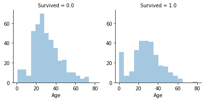

# Kaggle-鐵達尼生存預測分析

### 此專案的分析目標主要是藉由搭乘鐵達尼的乘客所擁有的屬性去預測這名乘客最後是否存活，1代表存活(survived)，0代表死亡(did not survived)。以下說明資料處理流程及預測結果。

## 1. 匯入需要的套件及資料集


```python
#匯入需要的套件
from sklearn import preprocessing 
from sklearn.model_selection import GridSearchCV 
from sklearn.ensemble import RandomForestClassifier 
from sklearn.ensemble import RandomForestRegressor

import warnings
import pandas as pd
import numpy as np
import matplotlib.pyplot as plt
import seaborn as sns

%matplotlib inline
pd.options.mode.chained_assignment = None
```


```python
#匯入資料集
train = pd.read_csv("Titanic/train.csv")
test = pd.read_csv("Titanic/test.csv")
submit = pd.read_csv('Titanic/gender_submission.csv')
```

## 2. 觀察資料的型態

### 2.1此數據訓練集共有891位乘客，資料內容包含:

* 乘客編號　PassengerId: int
* 存活與否　Survived: int
* 艙等　　　Pclass: int
* 姓名　　　Name: string
* 性別　　　Sex: string
* 年齡　　　Age: float
* 親戚人數　SibSp: int
* 父母子女人數　Parch: int
* 船票編號　Ticket: string
* 船票費用　Fare: float
* 船艙座位　Cabin: string
* 搭乘港口　Embarked: string


```python
train.head(5)
```


<div>
<style>
    .dataframe thead tr:only-child th {
        text-align: right;
    }

    .dataframe thead th {
        text-align: left;
    }

    .dataframe tbody tr th {
        vertical-align: top;
    }
</style>
<table border="1" class="dataframe">
  <thead>
    <tr style="text-align: right;">
      <th></th>
      <th>PassengerId</th>
      <th>Survived</th>
      <th>Pclass</th>
      <th>Name</th>
      <th>Sex</th>
      <th>Age</th>
      <th>SibSp</th>
      <th>Parch</th>
      <th>Ticket</th>
      <th>Fare</th>
      <th>Cabin</th>
      <th>Embarked</th>
    </tr>
  </thead>
  <tbody>
    <tr>
      <th>0</th>
      <td>1</td>
      <td>0</td>
      <td>3</td>
      <td>Braund, Mr. Owen Harris</td>
      <td>male</td>
      <td>22.0</td>
      <td>1</td>
      <td>0</td>
      <td>A/5 21171</td>
      <td>7.2500</td>
      <td>NaN</td>
      <td>S</td>
    </tr>
    <tr>
      <th>1</th>
      <td>2</td>
      <td>1</td>
      <td>1</td>
      <td>Cumings, Mrs. John Bradley (Florence Briggs Th...</td>
      <td>female</td>
      <td>38.0</td>
      <td>1</td>
      <td>0</td>
      <td>PC 17599</td>
      <td>71.2833</td>
      <td>C85</td>
      <td>C</td>
    </tr>
    <tr>
      <th>2</th>
      <td>3</td>
      <td>1</td>
      <td>3</td>
      <td>Heikkinen, Miss. Laina</td>
      <td>female</td>
      <td>26.0</td>
      <td>0</td>
      <td>0</td>
      <td>STON/O2. 3101282</td>
      <td>7.9250</td>
      <td>NaN</td>
      <td>S</td>
    </tr>
    <tr>
      <th>3</th>
      <td>4</td>
      <td>1</td>
      <td>1</td>
      <td>Futrelle, Mrs. Jacques Heath (Lily May Peel)</td>
      <td>female</td>
      <td>35.0</td>
      <td>1</td>
      <td>0</td>
      <td>113803</td>
      <td>53.1000</td>
      <td>C123</td>
      <td>S</td>
    </tr>
    <tr>
      <th>4</th>
      <td>5</td>
      <td>0</td>
      <td>3</td>
      <td>Allen, Mr. William Henry</td>
      <td>male</td>
      <td>35.0</td>
      <td>0</td>
      <td>0</td>
      <td>373450</td>
      <td>8.0500</td>
      <td>NaN</td>
      <td>S</td>
    </tr>
  </tbody>
</table>
</div>


### 2.2從以下測試集的資料可觀察到Age, Cabin, Fare等變數存在缺漏值的問題


```python
test.info()
```

    <class 'pandas.core.frame.DataFrame'>
    RangeIndex: 418 entries, 0 to 417
    Data columns (total 11 columns):
    PassengerId    418 non-null int64
    Pclass         418 non-null int64
    Name           418 non-null object
    Sex            418 non-null object
    Age            332 non-null float64
    SibSp          418 non-null int64
    Parch          418 non-null int64
    Ticket         418 non-null object
    Fare           417 non-null float64
    Cabin          91 non-null object
    Embarked       418 non-null object
    dtypes: float64(2), int64(4), object(5)
    memory usage: 36.0+ KB
    


```python
train.describe()
```


<div>
<style>
    .dataframe thead tr:only-child th {
        text-align: right;
    }

    .dataframe thead th {
        text-align: left;
    }

    .dataframe tbody tr th {
        vertical-align: top;
    }
</style>
<table border="1" class="dataframe">
  <thead>
    <tr style="text-align: right;">
      <th></th>
      <th>PassengerId</th>
      <th>Survived</th>
      <th>Pclass</th>
      <th>Age</th>
      <th>SibSp</th>
      <th>Parch</th>
      <th>Fare</th>
    </tr>
  </thead>
  <tbody>
    <tr>
      <th>count</th>
      <td>891.000000</td>
      <td>891.000000</td>
      <td>891.000000</td>
      <td>714.000000</td>
      <td>891.000000</td>
      <td>891.000000</td>
      <td>891.000000</td>
    </tr>
    <tr>
      <th>mean</th>
      <td>446.000000</td>
      <td>0.383838</td>
      <td>2.308642</td>
      <td>29.699118</td>
      <td>0.523008</td>
      <td>0.381594</td>
      <td>32.204208</td>
    </tr>
    <tr>
      <th>std</th>
      <td>257.353842</td>
      <td>0.486592</td>
      <td>0.836071</td>
      <td>14.526497</td>
      <td>1.102743</td>
      <td>0.806057</td>
      <td>49.693429</td>
    </tr>
    <tr>
      <th>min</th>
      <td>1.000000</td>
      <td>0.000000</td>
      <td>1.000000</td>
      <td>0.420000</td>
      <td>0.000000</td>
      <td>0.000000</td>
      <td>0.000000</td>
    </tr>
    <tr>
      <th>25%</th>
      <td>223.500000</td>
      <td>0.000000</td>
      <td>2.000000</td>
      <td>20.125000</td>
      <td>0.000000</td>
      <td>0.000000</td>
      <td>7.910400</td>
    </tr>
    <tr>
      <th>50%</th>
      <td>446.000000</td>
      <td>0.000000</td>
      <td>3.000000</td>
      <td>28.000000</td>
      <td>0.000000</td>
      <td>0.000000</td>
      <td>14.454200</td>
    </tr>
    <tr>
      <th>75%</th>
      <td>668.500000</td>
      <td>1.000000</td>
      <td>3.000000</td>
      <td>38.000000</td>
      <td>1.000000</td>
      <td>0.000000</td>
      <td>31.000000</td>
    </tr>
    <tr>
      <th>max</th>
      <td>891.000000</td>
      <td>1.000000</td>
      <td>3.000000</td>
      <td>80.000000</td>
      <td>8.000000</td>
      <td>6.000000</td>
      <td>512.329200</td>
    </tr>
  </tbody>
</table>
</div>


```python
test.describe()
```


<div>
<style>
    .dataframe thead tr:only-child th {
        text-align: right;
    }

    .dataframe thead th {
        text-align: left;
    }

    .dataframe tbody tr th {
        vertical-align: top;
    }
</style>
<table border="1" class="dataframe">
  <thead>
    <tr style="text-align: right;">
      <th></th>
      <th>PassengerId</th>
      <th>Pclass</th>
      <th>Age</th>
      <th>SibSp</th>
      <th>Parch</th>
      <th>Fare</th>
    </tr>
  </thead>
  <tbody>
    <tr>
      <th>count</th>
      <td>418.000000</td>
      <td>418.000000</td>
      <td>332.000000</td>
      <td>418.000000</td>
      <td>418.000000</td>
      <td>417.000000</td>
    </tr>
    <tr>
      <th>mean</th>
      <td>1100.500000</td>
      <td>2.265550</td>
      <td>30.272590</td>
      <td>0.447368</td>
      <td>0.392344</td>
      <td>35.627188</td>
    </tr>
    <tr>
      <th>std</th>
      <td>120.810458</td>
      <td>0.841838</td>
      <td>14.181209</td>
      <td>0.896760</td>
      <td>0.981429</td>
      <td>55.907576</td>
    </tr>
    <tr>
      <th>min</th>
      <td>892.000000</td>
      <td>1.000000</td>
      <td>0.170000</td>
      <td>0.000000</td>
      <td>0.000000</td>
      <td>0.000000</td>
    </tr>
    <tr>
      <th>25%</th>
      <td>996.250000</td>
      <td>1.000000</td>
      <td>21.000000</td>
      <td>0.000000</td>
      <td>0.000000</td>
      <td>7.895800</td>
    </tr>
    <tr>
      <th>50%</th>
      <td>1100.500000</td>
      <td>3.000000</td>
      <td>27.000000</td>
      <td>0.000000</td>
      <td>0.000000</td>
      <td>14.454200</td>
    </tr>
    <tr>
      <th>75%</th>
      <td>1204.750000</td>
      <td>3.000000</td>
      <td>39.000000</td>
      <td>1.000000</td>
      <td>0.000000</td>
      <td>31.500000</td>
    </tr>
    <tr>
      <th>max</th>
      <td>1309.000000</td>
      <td>3.000000</td>
      <td>76.000000</td>
      <td>8.000000</td>
      <td>9.000000</td>
      <td>512.329200</td>
    </tr>
  </tbody>
</table>
</div>


### 2.3將訓練資料及測試資料合併起來，利用敘述統計觀察變數間的關係


```python
data = train.append(test)
data.head(5)
```


<div>
<style>
    .dataframe thead tr:only-child th {
        text-align: right;
    }

    .dataframe thead th {
        text-align: left;
    }

    .dataframe tbody tr th {
        vertical-align: top;
    }
</style>
<table border="1" class="dataframe">
  <thead>
    <tr style="text-align: right;">
      <th></th>
      <th>Age</th>
      <th>Cabin</th>
      <th>Embarked</th>
      <th>Fare</th>
      <th>Name</th>
      <th>Parch</th>
      <th>PassengerId</th>
      <th>Pclass</th>
      <th>Sex</th>
      <th>SibSp</th>
      <th>Survived</th>
      <th>Ticket</th>
    </tr>
  </thead>
  <tbody>
    <tr>
      <th>0</th>
      <td>22.0</td>
      <td>NaN</td>
      <td>S</td>
      <td>7.2500</td>
      <td>Braund, Mr. Owen Harris</td>
      <td>0</td>
      <td>1</td>
      <td>3</td>
      <td>male</td>
      <td>1</td>
      <td>0.0</td>
      <td>A/5 21171</td>
    </tr>
    <tr>
      <th>1</th>
      <td>38.0</td>
      <td>C85</td>
      <td>C</td>
      <td>71.2833</td>
      <td>Cumings, Mrs. John Bradley (Florence Briggs Th...</td>
      <td>0</td>
      <td>2</td>
      <td>1</td>
      <td>female</td>
      <td>1</td>
      <td>1.0</td>
      <td>PC 17599</td>
    </tr>
    <tr>
      <th>2</th>
      <td>26.0</td>
      <td>NaN</td>
      <td>S</td>
      <td>7.9250</td>
      <td>Heikkinen, Miss. Laina</td>
      <td>0</td>
      <td>3</td>
      <td>3</td>
      <td>female</td>
      <td>0</td>
      <td>1.0</td>
      <td>STON/O2. 3101282</td>
    </tr>
    <tr>
      <th>3</th>
      <td>35.0</td>
      <td>C123</td>
      <td>S</td>
      <td>53.1000</td>
      <td>Futrelle, Mrs. Jacques Heath (Lily May Peel)</td>
      <td>0</td>
      <td>4</td>
      <td>1</td>
      <td>female</td>
      <td>1</td>
      <td>1.0</td>
      <td>113803</td>
    </tr>
    <tr>
      <th>4</th>
      <td>35.0</td>
      <td>NaN</td>
      <td>S</td>
      <td>8.0500</td>
      <td>Allen, Mr. William Henry</td>
      <td>0</td>
      <td>5</td>
      <td>3</td>
      <td>male</td>
      <td>0</td>
      <td>0.0</td>
      <td>373450</td>
    </tr>
  </tbody>
</table>
</div>


```python
data.reset_index(inplace=True, drop=True)
data.head(5)
```


<div>
<style>
    .dataframe thead tr:only-child th {
        text-align: right;
    }

    .dataframe thead th {
        text-align: left;
    }

    .dataframe tbody tr th {
        vertical-align: top;
    }
</style>
<table border="1" class="dataframe">
  <thead>
    <tr style="text-align: right;">
      <th></th>
      <th>Age</th>
      <th>Cabin</th>
      <th>Embarked</th>
      <th>Fare</th>
      <th>Name</th>
      <th>Parch</th>
      <th>PassengerId</th>
      <th>Pclass</th>
      <th>Sex</th>
      <th>SibSp</th>
      <th>Survived</th>
      <th>Ticket</th>
    </tr>
  </thead>
  <tbody>
    <tr>
      <th>0</th>
      <td>22.0</td>
      <td>NaN</td>
      <td>S</td>
      <td>7.2500</td>
      <td>Braund, Mr. Owen Harris</td>
      <td>0</td>
      <td>1</td>
      <td>3</td>
      <td>male</td>
      <td>1</td>
      <td>0.0</td>
      <td>A/5 21171</td>
    </tr>
    <tr>
      <th>1</th>
      <td>38.0</td>
      <td>C85</td>
      <td>C</td>
      <td>71.2833</td>
      <td>Cumings, Mrs. John Bradley (Florence Briggs Th...</td>
      <td>0</td>
      <td>2</td>
      <td>1</td>
      <td>female</td>
      <td>1</td>
      <td>1.0</td>
      <td>PC 17599</td>
    </tr>
    <tr>
      <th>2</th>
      <td>26.0</td>
      <td>NaN</td>
      <td>S</td>
      <td>7.9250</td>
      <td>Heikkinen, Miss. Laina</td>
      <td>0</td>
      <td>3</td>
      <td>3</td>
      <td>female</td>
      <td>0</td>
      <td>1.0</td>
      <td>STON/O2. 3101282</td>
    </tr>
    <tr>
      <th>3</th>
      <td>35.0</td>
      <td>C123</td>
      <td>S</td>
      <td>53.1000</td>
      <td>Futrelle, Mrs. Jacques Heath (Lily May Peel)</td>
      <td>0</td>
      <td>4</td>
      <td>1</td>
      <td>female</td>
      <td>1</td>
      <td>1.0</td>
      <td>113803</td>
    </tr>
    <tr>
      <th>4</th>
      <td>35.0</td>
      <td>NaN</td>
      <td>S</td>
      <td>8.0500</td>
      <td>Allen, Mr. William Henry</td>
      <td>0</td>
      <td>5</td>
      <td>3</td>
      <td>male</td>
      <td>0</td>
      <td>0.0</td>
      <td>373450</td>
    </tr>
  </tbody>
</table>
</div>


### 2.4觀察哪些情況下，存活的可能性較高，Survived=1為存活


```python
sns.countplot(data['Survived'])
```


    <matplotlib.axes._subplots.AxesSubplot at 0x199003f6128>


### 2.4.1不同的艙等所對應的存活情形不相同，艙等1的存活率較高，艙等3的存活率較低


```python
sns.countplot(data['Pclass'], hue=data['Survived'])
```


    <matplotlib.axes._subplots.AxesSubplot at 0x199006f2048>


### 2.4.2不同的等性別所對應的存活情形不相同，女性的存活率較高


```python
sns.countplot(data['Sex'], hue=data['Survived'])
```


    <matplotlib.axes._subplots.AxesSubplot at 0x1990088d908>


### 2.4.3不同的搭乘港口所對應的存活情形不相同，若從C港口上船存活率較高


```python
sns.countplot(data['Embarked'], hue=data['Survived'])
```


    <matplotlib.axes._subplots.AxesSubplot at 0x199008b30f0>


### 2.4.4年紀小於5歲的兒童的存活率較高


```python
g = sns.FacetGrid(data, col='Survived')
g.map(sns.distplot, 'Age', kde=False)
```


    <seaborn.axisgrid.FacetGrid at 0x1990093a978>





### 2.4.5單獨一人搭乘的存活率較低


```python
g = sns.FacetGrid(data, col='Survived')
g.map(sns.distplot, 'SibSp', kde=False)
```


    <seaborn.axisgrid.FacetGrid at 0x19900a1a048>


```python
g = sns.FacetGrid(data, col='Survived')
g.map(sns.distplot, 'Parch', kde=False)
```


    <seaborn.axisgrid.FacetGrid at 0x1990098ac88>


## 3. 特徵工程

### 3.1特徵建維：特徵建構主要是觀察原始數據，並將各個特徵做結合，建造新特徵。當相關性高的屬性合併後，將降低維度，有助於提高預測精準度

### 3.1.1 將Parch(家庭人數)與Sibsp(親戚人數)合併，創建Family新屬性


```python
data['Family_Size'] = data['Parch'] + data['SibSp']
```


```python
sns.countplot(data['Family_Size'], hue=data['Survived'])
```


    <matplotlib.axes._subplots.AxesSubplot at 0x19900c96a90>


### 3.1.2 原始資料有18個Title(稱謂)，但部份Title所代表的意涵相同，故將意涵相同的Title進行合併


```python
data['Title1'] = data['Name'].str.split(", ", expand=True)[1]
```


```python
data['Name'].str.split(", ", expand=True).head(3)
```


<div>
<style>
    .dataframe thead tr:only-child th {
        text-align: right;
    }

    .dataframe thead th {
        text-align: left;
    }

    .dataframe tbody tr th {
        vertical-align: top;
    }
</style>
<table border="1" class="dataframe">
  <thead>
    <tr style="text-align: right;">
      <th></th>
      <th>0</th>
      <th>1</th>
    </tr>
  </thead>
  <tbody>
    <tr>
      <th>0</th>
      <td>Braund</td>
      <td>Mr. Owen Harris</td>
    </tr>
    <tr>
      <th>1</th>
      <td>Cumings</td>
      <td>Mrs. John Bradley (Florence Briggs Thayer)</td>
    </tr>
    <tr>
      <th>2</th>
      <td>Heikkinen</td>
      <td>Miss. Laina</td>
    </tr>
  </tbody>
</table>
</div>


```python
data[['Title1']].head(3)
```


<div>
<style>
    .dataframe thead tr:only-child th {
        text-align: right;
    }

    .dataframe thead th {
        text-align: left;
    }

    .dataframe tbody tr th {
        vertical-align: top;
    }
</style>
<table border="1" class="dataframe">
  <thead>
    <tr style="text-align: right;">
      <th></th>
      <th>Title1</th>
    </tr>
  </thead>
  <tbody>
    <tr>
      <th>0</th>
      <td>Mr. Owen Harris</td>
    </tr>
    <tr>
      <th>1</th>
      <td>Mrs. John Bradley (Florence Briggs Thayer)</td>
    </tr>
    <tr>
      <th>2</th>
      <td>Miss. Laina</td>
    </tr>
  </tbody>
</table>
</div>


```python
data['Title1'] = data['Title1'].str.split(".", expand=True)[0]
```


```python
data[['Title1']].head(3)
```


<div>
<style>
    .dataframe thead tr:only-child th {
        text-align: right;
    }

    .dataframe thead th {
        text-align: left;
    }

    .dataframe tbody tr th {
        vertical-align: top;
    }
</style>
<table border="1" class="dataframe">
  <thead>
    <tr style="text-align: right;">
      <th></th>
      <th>Title1</th>
    </tr>
  </thead>
  <tbody>
    <tr>
      <th>0</th>
      <td>Mr</td>
    </tr>
    <tr>
      <th>1</th>
      <td>Mrs</td>
    </tr>
    <tr>
      <th>2</th>
      <td>Miss</td>
    </tr>
  </tbody>
</table>
</div>


```python
data['Title1'].unique()
```


    array(['Mr', 'Mrs', 'Miss', 'Master', 'Don', 'Rev', 'Dr', 'Mme', 'Ms',
           'Major', 'Lady', 'Sir', 'Mlle', 'Col', 'Capt', 'the Countess',
           'Jonkheer', 'Dona'], dtype=object)


```python
data['Title2'] = data['Title1'].replace(['Mlle','Mme','Ms','Dr','Major','Lady','the Countess','Jonkheer','Col','Rev','Capt','Sir','Don','Dona'],
         ['Miss','Mrs','Miss','Mr','Mr','Mrs','Mrs','Mr','Mr','Mr','Mr','Mr','Mr','Mrs'])
```


```python
data['Title2'].unique()
```


    array(['Mr', 'Mrs', 'Miss', 'Master'], dtype=object)


```python
data.groupby('Title2')['Age'].mean()
```


    Title2
    Master     5.482642
    Miss      21.824366
    Mr        32.811056
    Mrs       36.971264
    Name: Age, dtype: float64


```python
data.groupby(['Title2','Pclass'])['Age'].mean()
```


    Title2  Pclass
    Master  1          6.984000
            2          2.757273
            3          6.090000
    Miss    1         30.131148
            2         20.865714
            3         17.360874
    Mr      1         42.241497
            2         32.914966
            3         28.318910
    Mrs     1         42.802817
            2         33.518519
            3         32.326531
    Name: Age, dtype: float64


```python
list(data.groupby(['Title2','Pclass'])['Age'].mean().iteritems())[:3]
```


    [(('Master', 1), 6.984),
     (('Master', 2), 2.7572727272727273),
     (('Master', 3), 6.0900000000000007)]


### 3.1.3將船票上的資訊提取出來


```python
data['Ticket_info'] = data['Ticket'].apply(lambda x : x.replace(".","").replace("/","").strip().split(' ')[0] if not x.isdigit() else 'X')
```


```python
data['Ticket_info'].unique()
```


    array(['A5', 'PC', 'STONO2', 'X', 'PP', 'CA', 'SCParis', 'SCA4', 'A4',
           'SP', 'SOC', 'WC', 'SOTONOQ', 'WEP', 'STONO', 'C', 'SCPARIS', 'SOP',
           'Fa', 'LINE', 'FCC', 'SWPP', 'SCOW', 'PPP', 'SC', 'SCAH', 'AS',
           'SOPP', 'FC', 'SOTONO2', 'CASOTON', 'SCA3', 'STONOQ', 'AQ4', 'A',
           'LP', 'AQ3'], dtype=object)


```python
sns.countplot(data['Ticket_info'], hue=data['Survived'])
```


    <matplotlib.axes._subplots.AxesSubplot at 0x19900db5390>


### 3.2 補上遺漏值：Age, Cabin, Fare, Embarked

### 3.2.1以最多人上船之處做為搭乘港口(Embarked)遺漏值的補充基準


```python
data['Embarked'] = data['Embarked'].fillna('S')
```

### 3.2.2以平均船資做為船資(Fare)遺漏值的補充基準


```python
data['Fare'] = data['Fare'].fillna(data['Fare'].mean())
```

### 3.2.3因現有資料不易對乘客所屬船倉進行推測，故將遺漏值者視為NoCabin


```python
data["Cabin"] = data['Cabin'].apply(lambda x : str(x)[0] if not pd.isnull(x) else 'NoCabin')
```


```python
data["Cabin"].unique()
```


    array(['NoCabin', 'C', 'E', 'G', 'D', 'A', 'B', 'F', 'T'], dtype=object)


```python
sns.countplot(data['Cabin'], hue=data['Survived'])
```


    <matplotlib.axes._subplots.AxesSubplot at 0x19900ed55c0>


### 3.2.4利用迴歸模型推測搭乘者的年齡


```python
data['Sex'] = data['Sex'].astype('category').cat.codes
data['Embarked'] = data['Embarked'].astype('category').cat.codes
data['Pclass'] = data['Pclass'].astype('category').cat.codes
data['Title1'] = data['Title1'].astype('category').cat.codes
data['Title2'] = data['Title2'].astype('category').cat.codes
data['Cabin'] = data['Cabin'].astype('category').cat.codes
data['Ticket_info'] = data['Ticket_info'].astype('category').cat.codes
```


```python
dataAgeNull = data[data["Age"].isnull()]
dataAgeNotNull = data[data["Age"].notnull()]
remove_outlier = dataAgeNotNull[(np.abs(dataAgeNotNull["Fare"]-dataAgeNotNull["Fare"].mean())<(4*dataAgeNotNull["Fare"].std()))|
                      (np.abs(dataAgeNotNull["Family_Size"]-dataAgeNotNull["Family_Size"].mean())<(4*dataAgeNotNull["Family_Size"].std()))                     
                     ]
```


```python
rfModel_age = RandomForestRegressor(n_estimators=2000,random_state=42)
ageColumns = ['Embarked', 'Fare', 'Pclass', 'Sex', 'Family_Size', 'Title1', 'Title2','Cabin','Ticket_info']
rfModel_age.fit(remove_outlier[ageColumns], remove_outlier["Age"])

ageNullValues = rfModel_age.predict(X= dataAgeNull[ageColumns])
dataAgeNull.loc[:,"Age"] = ageNullValues
data = dataAgeNull.append(dataAgeNotNull)
data.reset_index(inplace=True, drop=True)
```


```python
remove_outlier.head(5)
```


<div>
<style>
    .dataframe thead tr:only-child th {
        text-align: right;
    }

    .dataframe thead th {
        text-align: left;
    }

    .dataframe tbody tr th {
        vertical-align: top;
    }
</style>
<table border="1" class="dataframe">
  <thead>
    <tr style="text-align: right;">
      <th></th>
      <th>Age</th>
      <th>Cabin</th>
      <th>Embarked</th>
      <th>Fare</th>
      <th>Name</th>
      <th>Parch</th>
      <th>PassengerId</th>
      <th>Pclass</th>
      <th>Sex</th>
      <th>SibSp</th>
      <th>Survived</th>
      <th>Ticket</th>
      <th>Family_Size</th>
      <th>Title1</th>
      <th>Title2</th>
      <th>Ticket_info</th>
    </tr>
  </thead>
  <tbody>
    <tr>
      <th>0</th>
      <td>22.0</td>
      <td>7</td>
      <td>2</td>
      <td>7.2500</td>
      <td>Braund, Mr. Owen Harris</td>
      <td>0</td>
      <td>1</td>
      <td>2</td>
      <td>1</td>
      <td>1</td>
      <td>0.0</td>
      <td>A/5 21171</td>
      <td>1</td>
      <td>12</td>
      <td>2</td>
      <td>2</td>
    </tr>
    <tr>
      <th>1</th>
      <td>38.0</td>
      <td>2</td>
      <td>0</td>
      <td>71.2833</td>
      <td>Cumings, Mrs. John Bradley (Florence Briggs Th...</td>
      <td>0</td>
      <td>2</td>
      <td>0</td>
      <td>0</td>
      <td>1</td>
      <td>1.0</td>
      <td>PC 17599</td>
      <td>1</td>
      <td>13</td>
      <td>3</td>
      <td>14</td>
    </tr>
    <tr>
      <th>2</th>
      <td>26.0</td>
      <td>7</td>
      <td>2</td>
      <td>7.9250</td>
      <td>Heikkinen, Miss. Laina</td>
      <td>0</td>
      <td>3</td>
      <td>2</td>
      <td>0</td>
      <td>0</td>
      <td>1.0</td>
      <td>STON/O2. 3101282</td>
      <td>0</td>
      <td>9</td>
      <td>1</td>
      <td>31</td>
    </tr>
    <tr>
      <th>3</th>
      <td>35.0</td>
      <td>2</td>
      <td>2</td>
      <td>53.1000</td>
      <td>Futrelle, Mrs. Jacques Heath (Lily May Peel)</td>
      <td>0</td>
      <td>4</td>
      <td>0</td>
      <td>0</td>
      <td>1</td>
      <td>1.0</td>
      <td>113803</td>
      <td>1</td>
      <td>13</td>
      <td>3</td>
      <td>36</td>
    </tr>
    <tr>
      <th>4</th>
      <td>35.0</td>
      <td>7</td>
      <td>2</td>
      <td>8.0500</td>
      <td>Allen, Mr. William Henry</td>
      <td>0</td>
      <td>5</td>
      <td>2</td>
      <td>1</td>
      <td>0</td>
      <td>0.0</td>
      <td>373450</td>
      <td>0</td>
      <td>12</td>
      <td>2</td>
      <td>36</td>
    </tr>
  </tbody>
</table>
</div>


### 3.3特徵提取：特徵提取主要是將變數從文字轉換成數字/序數值，以利統計與導入演算法模型。例如：將連續型變數進行切分，以精簡模型；將定性變數進行「one-hot encoding」，讓模型在計算時了解到此類變數的順序不具備大小的關係

### 3.3.1Cut(Fare, Age)


```python
#計算Fare分5等分
data.FareCut=pd.qcut(data.Fare,4)
#Fare分組
data.loc[data.Fare<=2.06,'FareCut']=1
data.loc[(data.Fare>2.06)&(data.Fare<=2.35),'FareCut']=2
data.loc[(data.Fare>2.35)&(data.Fare<=3.05),'FareCut']=3
data.loc[(data.Fare>3.05)&(data.Fare<=3.68),'FareCut']=4
data.loc[data.Fare>3.68,'FareCut']=5

#將Age分成六等分
data.AgeCut=pd.cut(data.Age,5)
data.loc[data.Age<=5,'AgeCut']=1                      # Baby
data.loc[(data.Age>5)&(data.Fare<=12),'AgeCut']=2     # Child
data.loc[(data.Age>12)&(data.Fare<=24),'AgeCut']=3    # Teenager
data.loc[(data.Age>24)&(data.Fare<=40),'AgeCut']=4    # young adult
data.loc[(data.Age>40)&(data.Fare<=60),'AgeCut']=5    # Adult
data.loc[data.Age>60,'AgeCut']=6                      # Senior
```

### 3.3.2 one-hot encoding(Pclass & Title)


```python
data = pd.get_dummies(data, columns = ["Pclass"])
```


```python
data = pd.get_dummies(data, columns = ["Embarked"], prefix="Em")
```


```python
data.reset_index(inplace=True, drop=True)
```


```python
data.describe()
```


<div>
<style>
    .dataframe thead tr:only-child th {
        text-align: right;
    }

    .dataframe thead th {
        text-align: left;
    }

    .dataframe tbody tr th {
        vertical-align: top;
    }
</style>
<table border="1" class="dataframe">
  <thead>
    <tr style="text-align: right;">
      <th></th>
      <th>Age</th>
      <th>Cabin</th>
      <th>Fare</th>
      <th>Parch</th>
      <th>PassengerId</th>
      <th>Sex</th>
      <th>SibSp</th>
      <th>Survived</th>
      <th>Family_Size</th>
      <th>Title1</th>
      <th>Title2</th>
      <th>Ticket_info</th>
      <th>FareCut</th>
      <th>AgeCut</th>
      <th>Pclass_0</th>
      <th>Pclass_1</th>
      <th>Pclass_2</th>
      <th>Em_0</th>
      <th>Em_1</th>
      <th>Em_2</th>
    </tr>
  </thead>
  <tbody>
    <tr>
      <th>count</th>
      <td>1309.000000</td>
      <td>1309.000000</td>
      <td>1309.000000</td>
      <td>1309.000000</td>
      <td>1309.000000</td>
      <td>1309.000000</td>
      <td>1309.000000</td>
      <td>891.000000</td>
      <td>1309.000000</td>
      <td>1309.000000</td>
      <td>1309.000000</td>
      <td>1309.000000</td>
      <td>1309.000000</td>
      <td>1019.000000</td>
      <td>1309.000000</td>
      <td>1309.000000</td>
      <td>1309.000000</td>
      <td>1309.000000</td>
      <td>1309.000000</td>
      <td>1309.000000</td>
    </tr>
    <tr>
      <th>mean</th>
      <td>29.892480</td>
      <td>5.955691</td>
      <td>33.295479</td>
      <td>0.385027</td>
      <td>655.000000</td>
      <td>0.644003</td>
      <td>0.498854</td>
      <td>0.383838</td>
      <td>0.883881</td>
      <td>11.268908</td>
      <td>1.858671</td>
      <td>30.428571</td>
      <td>4.947288</td>
      <td>3.813543</td>
      <td>0.246753</td>
      <td>0.211612</td>
      <td>0.541635</td>
      <td>0.206264</td>
      <td>0.093965</td>
      <td>0.699771</td>
    </tr>
    <tr>
      <th>std</th>
      <td>13.581563</td>
      <td>2.057178</td>
      <td>51.738879</td>
      <td>0.865560</td>
      <td>378.020061</td>
      <td>0.478997</td>
      <td>1.041658</td>
      <td>0.486592</td>
      <td>1.583639</td>
      <td>1.833961</td>
      <td>0.722537</td>
      <td>10.479504</td>
      <td>0.453801</td>
      <td>1.032180</td>
      <td>0.431287</td>
      <td>0.408607</td>
      <td>0.498454</td>
      <td>0.404777</td>
      <td>0.291891</td>
      <td>0.458533</td>
    </tr>
    <tr>
      <th>min</th>
      <td>0.170000</td>
      <td>0.000000</td>
      <td>0.000000</td>
      <td>0.000000</td>
      <td>1.000000</td>
      <td>0.000000</td>
      <td>0.000000</td>
      <td>0.000000</td>
      <td>0.000000</td>
      <td>0.000000</td>
      <td>0.000000</td>
      <td>0.000000</td>
      <td>1.000000</td>
      <td>1.000000</td>
      <td>0.000000</td>
      <td>0.000000</td>
      <td>0.000000</td>
      <td>0.000000</td>
      <td>0.000000</td>
      <td>0.000000</td>
    </tr>
    <tr>
      <th>25%</th>
      <td>22.000000</td>
      <td>7.000000</td>
      <td>7.895800</td>
      <td>0.000000</td>
      <td>328.000000</td>
      <td>0.000000</td>
      <td>0.000000</td>
      <td>0.000000</td>
      <td>0.000000</td>
      <td>9.000000</td>
      <td>2.000000</td>
      <td>31.000000</td>
      <td>5.000000</td>
      <td>3.000000</td>
      <td>0.000000</td>
      <td>0.000000</td>
      <td>0.000000</td>
      <td>0.000000</td>
      <td>0.000000</td>
      <td>0.000000</td>
    </tr>
    <tr>
      <th>50%</th>
      <td>28.000000</td>
      <td>7.000000</td>
      <td>14.454200</td>
      <td>0.000000</td>
      <td>655.000000</td>
      <td>1.000000</td>
      <td>0.000000</td>
      <td>0.000000</td>
      <td>0.000000</td>
      <td>12.000000</td>
      <td>2.000000</td>
      <td>36.000000</td>
      <td>5.000000</td>
      <td>4.000000</td>
      <td>0.000000</td>
      <td>0.000000</td>
      <td>1.000000</td>
      <td>0.000000</td>
      <td>0.000000</td>
      <td>1.000000</td>
    </tr>
    <tr>
      <th>75%</th>
      <td>38.000000</td>
      <td>7.000000</td>
      <td>31.275000</td>
      <td>0.000000</td>
      <td>982.000000</td>
      <td>1.000000</td>
      <td>1.000000</td>
      <td>1.000000</td>
      <td>1.000000</td>
      <td>12.000000</td>
      <td>2.000000</td>
      <td>36.000000</td>
      <td>5.000000</td>
      <td>4.000000</td>
      <td>0.000000</td>
      <td>0.000000</td>
      <td>1.000000</td>
      <td>0.000000</td>
      <td>0.000000</td>
      <td>1.000000</td>
    </tr>
    <tr>
      <th>max</th>
      <td>80.000000</td>
      <td>8.000000</td>
      <td>512.329200</td>
      <td>9.000000</td>
      <td>1309.000000</td>
      <td>1.000000</td>
      <td>8.000000</td>
      <td>1.000000</td>
      <td>10.000000</td>
      <td>17.000000</td>
      <td>3.000000</td>
      <td>36.000000</td>
      <td>5.000000</td>
      <td>6.000000</td>
      <td>1.000000</td>
      <td>1.000000</td>
      <td>1.000000</td>
      <td>1.000000</td>
      <td>1.000000</td>
      <td>1.000000</td>
    </tr>
  </tbody>
</table>
</div>


```python
data.info()
```

    <class 'pandas.core.frame.DataFrame'>
    RangeIndex: 1309 entries, 0 to 1308
    Data columns (total 22 columns):
    Age            1309 non-null float64
    Cabin          1309 non-null int8
    Fare           1309 non-null float64
    Name           1309 non-null object
    Parch          1309 non-null int64
    PassengerId    1309 non-null int64
    Sex            1309 non-null int8
    SibSp          1309 non-null int64
    Survived       891 non-null float64
    Ticket         1309 non-null object
    Family_Size    1309 non-null int64
    Title1         1309 non-null int8
    Title2         1309 non-null int8
    Ticket_info    1309 non-null int8
    FareCut        1309 non-null float64
    AgeCut         1019 non-null float64
    Pclass_0       1309 non-null uint8
    Pclass_1       1309 non-null uint8
    Pclass_2       1309 non-null uint8
    Em_0           1309 non-null uint8
    Em_1           1309 non-null uint8
    Em_2           1309 non-null uint8
    dtypes: float64(5), int64(4), int8(5), object(2), uint8(6)
    memory usage: 126.6+ KB
    

## 4. 模型建立


```python
dataTrain = data[pd.notnull(data['Survived'])].sort_values(by=["PassengerId"])
dataTest = data[~pd.notnull(data['Survived'])].sort_values(by=["PassengerId"])
```


```python
dataTrain.columns
```


    Index(['Age', 'Cabin', 'Fare', 'Name', 'Parch', 'PassengerId', 'Sex', 'SibSp',
           'Survived', 'Ticket', 'Family_Size', 'Title1', 'Title2', 'Ticket_info',
           'FareCut', 'AgeCut', 'Pclass_0', 'Pclass_1', 'Pclass_2', 'Em_0', 'Em_1',
           'Em_2'],
          dtype='object')


```python
dataTrain = dataTrain[['Survived', 'Age', 'Em_0', 'Em_1', 'Em_2','Fare', 'Pclass_0', 'Pclass_1', 'Pclass_2','Sex', 'Family_Size', 'Title2','Ticket_info','Cabin']]
dataTest = dataTest[['Age', 'Em_0', 'Em_1', 'Em_2','Fare', 'Pclass_0', 'Pclass_1', 'Pclass_2','Sex', 'Family_Size', 'Title2','Ticket_info','Cabin']]
```


```python
dataTrain.head(3)
```


<div>
<style>
    .dataframe thead tr:only-child th {
        text-align: right;
    }

    .dataframe thead th {
        text-align: left;
    }

    .dataframe tbody tr th {
        vertical-align: top;
    }
</style>
<table border="1" class="dataframe">
  <thead>
    <tr style="text-align: right;">
      <th></th>
      <th>Survived</th>
      <th>Age</th>
      <th>Em_0</th>
      <th>Em_1</th>
      <th>Em_2</th>
      <th>Fare</th>
      <th>Pclass_0</th>
      <th>Pclass_1</th>
      <th>Pclass_2</th>
      <th>Sex</th>
      <th>Family_Size</th>
      <th>Title2</th>
      <th>Ticket_info</th>
      <th>Cabin</th>
    </tr>
  </thead>
  <tbody>
    <tr>
      <th>263</th>
      <td>0.0</td>
      <td>22.0</td>
      <td>0</td>
      <td>0</td>
      <td>1</td>
      <td>7.2500</td>
      <td>0</td>
      <td>0</td>
      <td>1</td>
      <td>1</td>
      <td>1</td>
      <td>2</td>
      <td>2</td>
      <td>7</td>
    </tr>
    <tr>
      <th>264</th>
      <td>1.0</td>
      <td>38.0</td>
      <td>1</td>
      <td>0</td>
      <td>0</td>
      <td>71.2833</td>
      <td>1</td>
      <td>0</td>
      <td>0</td>
      <td>0</td>
      <td>1</td>
      <td>3</td>
      <td>14</td>
      <td>2</td>
    </tr>
    <tr>
      <th>265</th>
      <td>1.0</td>
      <td>26.0</td>
      <td>0</td>
      <td>0</td>
      <td>1</td>
      <td>7.9250</td>
      <td>0</td>
      <td>0</td>
      <td>1</td>
      <td>0</td>
      <td>0</td>
      <td>1</td>
      <td>31</td>
      <td>7</td>
    </tr>
  </tbody>
</table>
</div>


```python
rf = RandomForestClassifier(oob_score=True, random_state=1, n_jobs=-1)
param_grid = { "criterion" : ["gini", "entropy"], "min_samples_leaf" : [1, 5, 10], "min_samples_split" : [2, 4, 10, 12, 16, 20], "n_estimators": [50, 100, 400, 700, 1000]}
gs = GridSearchCV(estimator=rf, param_grid=param_grid, scoring='accuracy', cv=3, n_jobs=-1)

gs = gs.fit(dataTrain.iloc[:, 1:], dataTrain.iloc[:, 0])

print(gs.best_score_)
print(gs.best_params_)
```

    0.841750841751
    {'criterion': 'entropy', 'min_samples_leaf': 1, 'min_samples_split': 16, 'n_estimators': 100}
    


```python
from sklearn.ensemble import RandomForestClassifier
 
rf = RandomForestClassifier(criterion='entropy', 
                             n_estimators=100,
                             min_samples_split=16,
                             min_samples_leaf=1,
                             oob_score=True,
                             random_state=1,
                             n_jobs=-1) 

rf.fit(dataTrain.iloc[:, 1:], dataTrain.iloc[:, 0])
print("%.4f" % rf.oob_score_)
```

    0.8305
    


```python
pd.concat((pd.DataFrame(dataTrain.iloc[:, 1:].columns, columns = ['variable']), 
           pd.DataFrame(rf.feature_importances_, columns = ['importance'])), 
          axis = 1).sort_values(by='importance', ascending = False)[:20]
```


<div>
<style>
    .dataframe thead tr:only-child th {
        text-align: right;
    }

    .dataframe thead th {
        text-align: left;
    }

    .dataframe tbody tr th {
        vertical-align: top;
    }
</style>
<table border="1" class="dataframe">
  <thead>
    <tr style="text-align: right;">
      <th></th>
      <th>variable</th>
      <th>importance</th>
    </tr>
  </thead>
  <tbody>
    <tr>
      <th>8</th>
      <td>Sex</td>
      <td>0.221129</td>
    </tr>
    <tr>
      <th>4</th>
      <td>Fare</td>
      <td>0.166701</td>
    </tr>
    <tr>
      <th>10</th>
      <td>Title2</td>
      <td>0.156870</td>
    </tr>
    <tr>
      <th>0</th>
      <td>Age</td>
      <td>0.151770</td>
    </tr>
    <tr>
      <th>7</th>
      <td>Pclass_2</td>
      <td>0.066590</td>
    </tr>
    <tr>
      <th>12</th>
      <td>Cabin</td>
      <td>0.061214</td>
    </tr>
    <tr>
      <th>9</th>
      <td>Family_Size</td>
      <td>0.057541</td>
    </tr>
    <tr>
      <th>11</th>
      <td>Ticket_info</td>
      <td>0.038862</td>
    </tr>
    <tr>
      <th>5</th>
      <td>Pclass_0</td>
      <td>0.025806</td>
    </tr>
    <tr>
      <th>6</th>
      <td>Pclass_1</td>
      <td>0.020185</td>
    </tr>
    <tr>
      <th>3</th>
      <td>Em_2</td>
      <td>0.014018</td>
    </tr>
    <tr>
      <th>1</th>
      <td>Em_0</td>
      <td>0.011104</td>
    </tr>
    <tr>
      <th>2</th>
      <td>Em_1</td>
      <td>0.008210</td>
    </tr>
  </tbody>
</table>
</div>


```python
from sklearn.svm import SVC
from sklearn.model_selection import GridSearchCV, cross_val_score, StratifiedKFold, learning_curve
```


```python
dataTrain["Survived"].astype(int)
y = dataTrain["Survived"]
X = dataTrain.drop(labels =["Survived"], axis = 1)
```


```python
from sklearn.model_selection import train_test_split
X_train, X_cv, y_train, y_cv = train_test_split(X, y, test_size = 0.3)
```


```python
from sklearn.preprocessing import StandardScaler
sc = StandardScaler()
sc.fit(X_train)
X_train_normalized = sc.transform(X_train)
X_cv_normalized = sc.transform(X_cv)
```


```python
kfold = StratifiedKFold(n_splits=10)

SVMC = SVC(probability=True)
svc_param_grid = {'kernel': ['rbf'], 
                  'gamma': [10**i for i in range(-2, 2)],
                  'C': [10**i for i in range(-1, 2)]}

gsSVMC = GridSearchCV(SVMC,param_grid = svc_param_grid, cv=kfold, scoring="accuracy", n_jobs= 2, verbose = 1)
gsSVMC.fit(X_train_normalized, y_train.values.ravel())
SVMC_best = gsSVMC.best_estimator_

# Best score
print(gsSVMC.best_score_)
print(gsSVMC.best_params_)
```

    Fitting 10 folds for each of 12 candidates, totalling 120 fits
    0.841091492777
    {'C': 10, 'gamma': 0.01, 'kernel': 'rbf'}
    

    [Parallel(n_jobs=2)]: Done 120 out of 120 | elapsed:    5.0s finished
    


```python
rf_res =  rf.predict(dataTest)
submit['Survived'] = rf_res
submit['Survived'] = submit['Survived'].astype(int)
submit.to_csv('submit2.csv', index= False)
```


```python
submit
```


<div>
<style>
    .dataframe thead tr:only-child th {
        text-align: right;
    }

    .dataframe thead th {
        text-align: left;
    }

    .dataframe tbody tr th {
        vertical-align: top;
    }
</style>
<table border="1" class="dataframe">
  <thead>
    <tr style="text-align: right;">
      <th></th>
      <th>PassengerId</th>
      <th>Survived</th>
    </tr>
  </thead>
  <tbody>
    <tr>
      <th>0</th>
      <td>892</td>
      <td>0</td>
    </tr>
    <tr>
      <th>1</th>
      <td>893</td>
      <td>0</td>
    </tr>
    <tr>
      <th>2</th>
      <td>894</td>
      <td>0</td>
    </tr>
    <tr>
      <th>3</th>
      <td>895</td>
      <td>0</td>
    </tr>
    <tr>
      <th>4</th>
      <td>896</td>
      <td>1</td>
    </tr>
    <tr>
      <th>5</th>
      <td>897</td>
      <td>0</td>
    </tr>
    <tr>
      <th>6</th>
      <td>898</td>
      <td>0</td>
    </tr>
    <tr>
      <th>7</th>
      <td>899</td>
      <td>0</td>
    </tr>
    <tr>
      <th>8</th>
      <td>900</td>
      <td>1</td>
    </tr>
    <tr>
      <th>9</th>
      <td>901</td>
      <td>0</td>
    </tr>
    <tr>
      <th>10</th>
      <td>902</td>
      <td>0</td>
    </tr>
    <tr>
      <th>11</th>
      <td>903</td>
      <td>0</td>
    </tr>
    <tr>
      <th>12</th>
      <td>904</td>
      <td>1</td>
    </tr>
    <tr>
      <th>13</th>
      <td>905</td>
      <td>0</td>
    </tr>
    <tr>
      <th>14</th>
      <td>906</td>
      <td>1</td>
    </tr>
    <tr>
      <th>15</th>
      <td>907</td>
      <td>1</td>
    </tr>
    <tr>
      <th>16</th>
      <td>908</td>
      <td>0</td>
    </tr>
    <tr>
      <th>17</th>
      <td>909</td>
      <td>0</td>
    </tr>
    <tr>
      <th>18</th>
      <td>910</td>
      <td>0</td>
    </tr>
    <tr>
      <th>19</th>
      <td>911</td>
      <td>1</td>
    </tr>
    <tr>
      <th>20</th>
      <td>912</td>
      <td>0</td>
    </tr>
    <tr>
      <th>21</th>
      <td>913</td>
      <td>1</td>
    </tr>
    <tr>
      <th>22</th>
      <td>914</td>
      <td>1</td>
    </tr>
    <tr>
      <th>23</th>
      <td>915</td>
      <td>0</td>
    </tr>
    <tr>
      <th>24</th>
      <td>916</td>
      <td>1</td>
    </tr>
    <tr>
      <th>25</th>
      <td>917</td>
      <td>0</td>
    </tr>
    <tr>
      <th>26</th>
      <td>918</td>
      <td>1</td>
    </tr>
    <tr>
      <th>27</th>
      <td>919</td>
      <td>0</td>
    </tr>
    <tr>
      <th>28</th>
      <td>920</td>
      <td>0</td>
    </tr>
    <tr>
      <th>29</th>
      <td>921</td>
      <td>0</td>
    </tr>
    <tr>
      <th>...</th>
      <td>...</td>
      <td>...</td>
    </tr>
    <tr>
      <th>388</th>
      <td>1280</td>
      <td>0</td>
    </tr>
    <tr>
      <th>389</th>
      <td>1281</td>
      <td>0</td>
    </tr>
    <tr>
      <th>390</th>
      <td>1282</td>
      <td>0</td>
    </tr>
    <tr>
      <th>391</th>
      <td>1283</td>
      <td>1</td>
    </tr>
    <tr>
      <th>392</th>
      <td>1284</td>
      <td>1</td>
    </tr>
    <tr>
      <th>393</th>
      <td>1285</td>
      <td>0</td>
    </tr>
    <tr>
      <th>394</th>
      <td>1286</td>
      <td>0</td>
    </tr>
    <tr>
      <th>395</th>
      <td>1287</td>
      <td>1</td>
    </tr>
    <tr>
      <th>396</th>
      <td>1288</td>
      <td>0</td>
    </tr>
    <tr>
      <th>397</th>
      <td>1289</td>
      <td>1</td>
    </tr>
    <tr>
      <th>398</th>
      <td>1290</td>
      <td>0</td>
    </tr>
    <tr>
      <th>399</th>
      <td>1291</td>
      <td>0</td>
    </tr>
    <tr>
      <th>400</th>
      <td>1292</td>
      <td>1</td>
    </tr>
    <tr>
      <th>401</th>
      <td>1293</td>
      <td>0</td>
    </tr>
    <tr>
      <th>402</th>
      <td>1294</td>
      <td>1</td>
    </tr>
    <tr>
      <th>403</th>
      <td>1295</td>
      <td>0</td>
    </tr>
    <tr>
      <th>404</th>
      <td>1296</td>
      <td>1</td>
    </tr>
    <tr>
      <th>405</th>
      <td>1297</td>
      <td>0</td>
    </tr>
    <tr>
      <th>406</th>
      <td>1298</td>
      <td>0</td>
    </tr>
    <tr>
      <th>407</th>
      <td>1299</td>
      <td>0</td>
    </tr>
    <tr>
      <th>408</th>
      <td>1300</td>
      <td>1</td>
    </tr>
    <tr>
      <th>409</th>
      <td>1301</td>
      <td>1</td>
    </tr>
    <tr>
      <th>410</th>
      <td>1302</td>
      <td>1</td>
    </tr>
    <tr>
      <th>411</th>
      <td>1303</td>
      <td>1</td>
    </tr>
    <tr>
      <th>412</th>
      <td>1304</td>
      <td>0</td>
    </tr>
    <tr>
      <th>413</th>
      <td>1305</td>
      <td>0</td>
    </tr>
    <tr>
      <th>414</th>
      <td>1306</td>
      <td>1</td>
    </tr>
    <tr>
      <th>415</th>
      <td>1307</td>
      <td>0</td>
    </tr>
    <tr>
      <th>416</th>
      <td>1308</td>
      <td>0</td>
    </tr>
    <tr>
      <th>417</th>
      <td>1309</td>
      <td>1</td>
    </tr>
  </tbody>
</table>
<p>418 rows × 2 columns</p>
</div>


